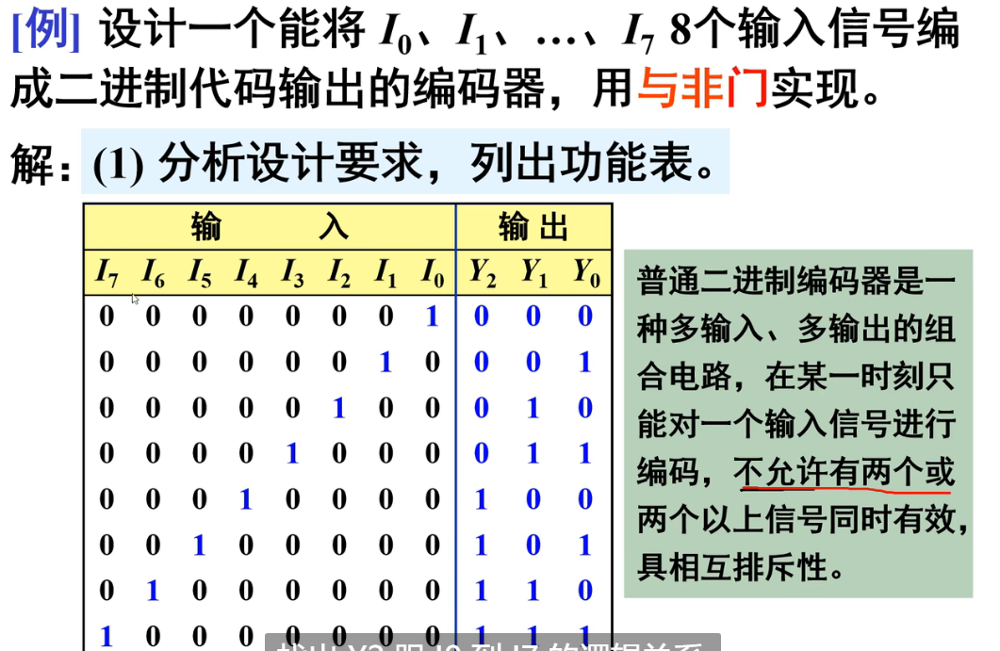
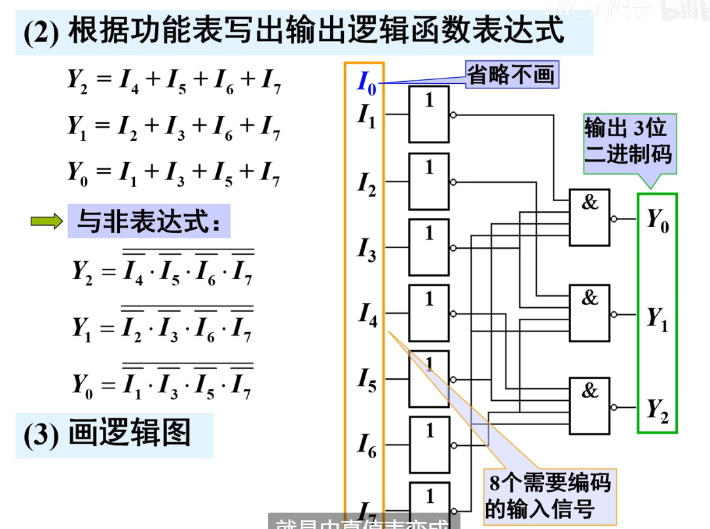

[toc]

## 编码器

### 1-1 编码器概述

### 1-2 二进制编码器

#### 8-3译码器

* ==二进制编码器可以直接根据真值表直接写,就像上面Y2的写法==

#### 10-4译码器(不完全编码)

* 略

#### 优先编码器

* 概念

* 例:8-3

==**注意列写逻辑式**==

优先编码器的逻辑表达式只需要看不是×的部分,进行化简,例:

* 芯片:8-3优先编码器

==注:上面一个杠意思是低电平有效==

##### 重点:2片74LS148(8-3编码器)实现16-4线**优先**编码器

* 解释:这里的"优先"其实就是说高位优于低位,15-0是10进制数,所以想要正确输出,那么由于是低电平有效,所以需要1111...101...111的形式,那么0为输入
  * 关键在于高位Ys连接低位ST非,原因在于高位使能但是不干活(也就是无>9的输入时),Ys为0,刚好低电平有效使能低位的ST非,使得低位有效,可以干活(体现了"优先"的理论)
  * 与门自己简单分析即可

* 芯片:10-4线优先编码器

* 功能表

