## 同步触发器

[toc]

### 1-1 概念

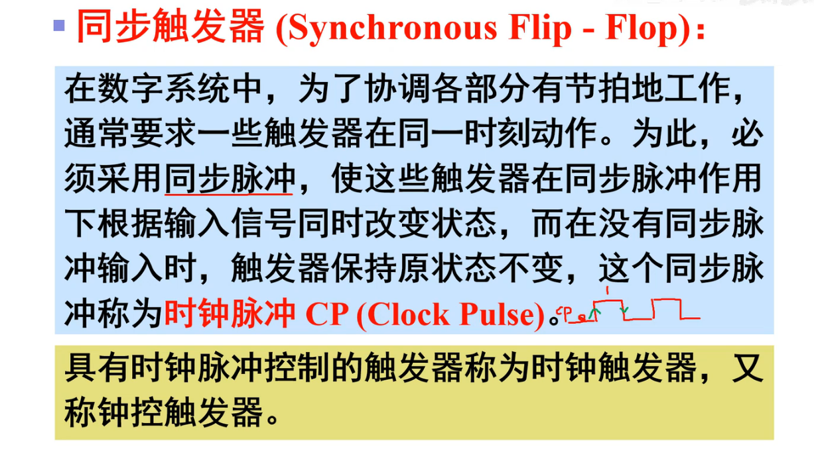

### 1-2 同步RS触发器

* 电路组成
  * 注**:R S 都是高电平有效**

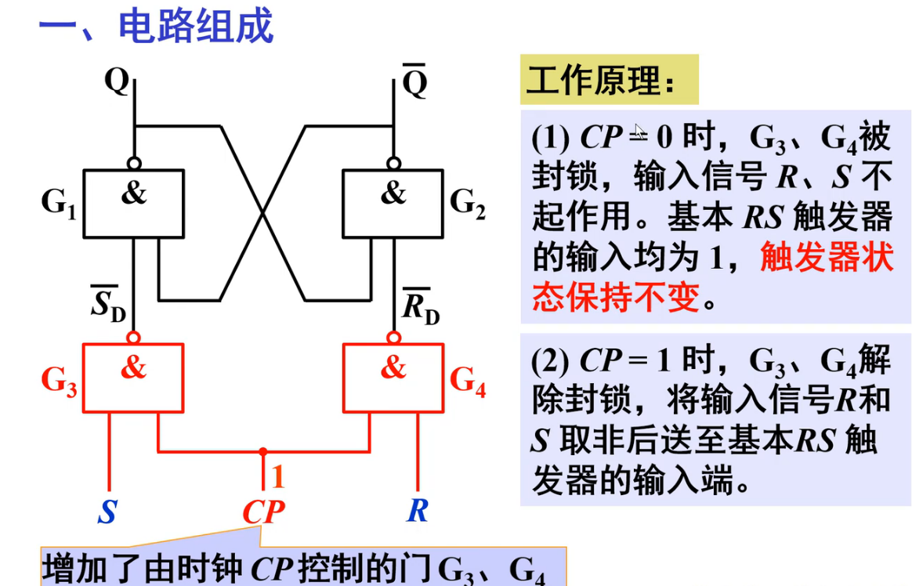

***

* 逻辑功能
  * ==CP = 0时封锁了,也就是锁存==

* 异步输入端
  * 电路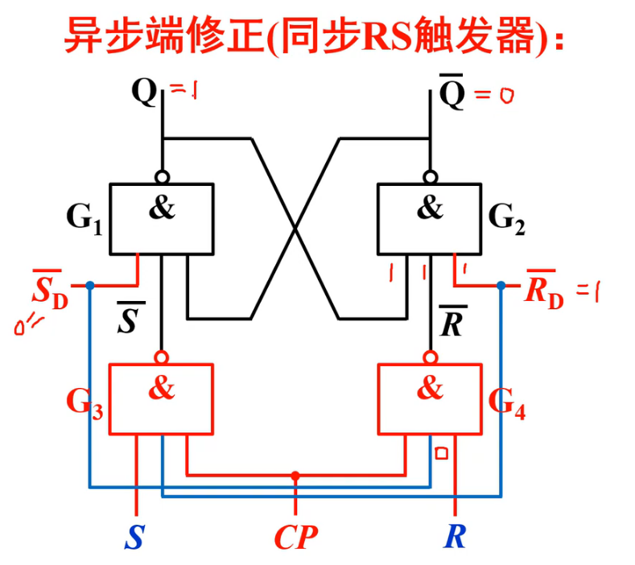
    

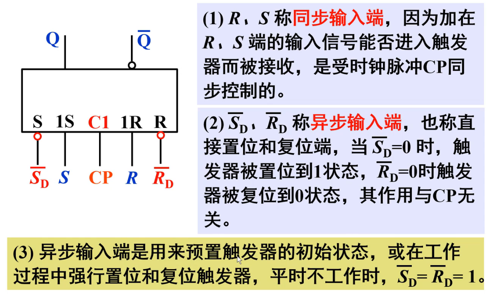

***

* 特性表,特性方程

***

* 状态转移图

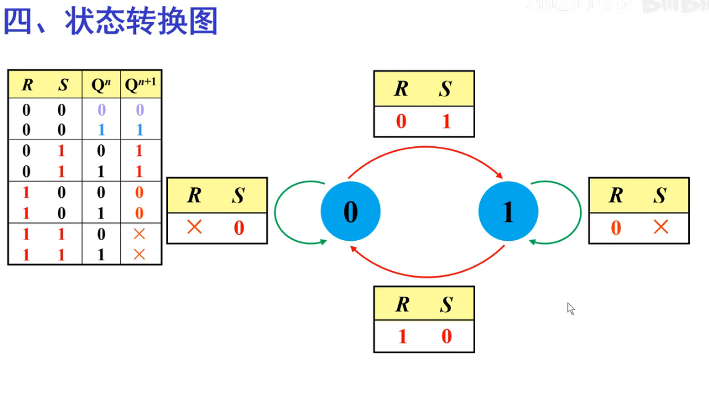

***

例:

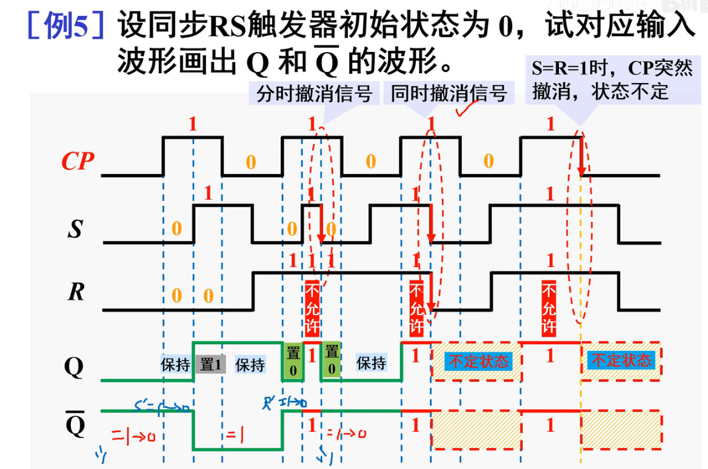

* 其中最需要理解的是第2个不定状态:

  * 

  * 将R,S看做CP,恒为(其实是在这个区间)1,从1变成0,
  * 而CP看成S'和R',,**那么S'和R'则为"同时撤销"模型**,那不就是不定状态吗

***

* 同步RS触发器的优缺点

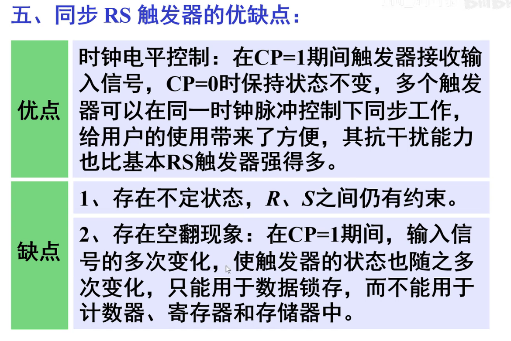

### 1-3 同步D触发器

* 电路组成
  * **D的存在使得RS没有约束条件了**

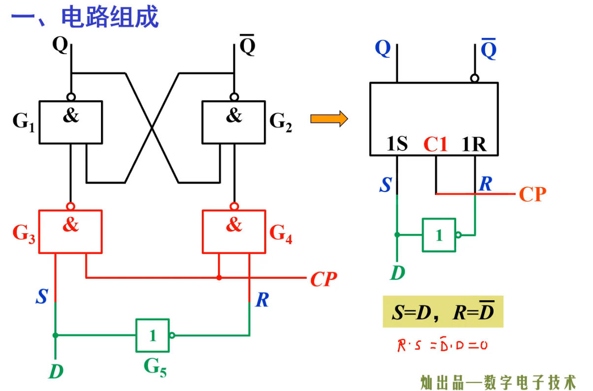

***

* 工作原理
  * CP = 0 , 触发器保持原态
  * CP = 1 , 见下面

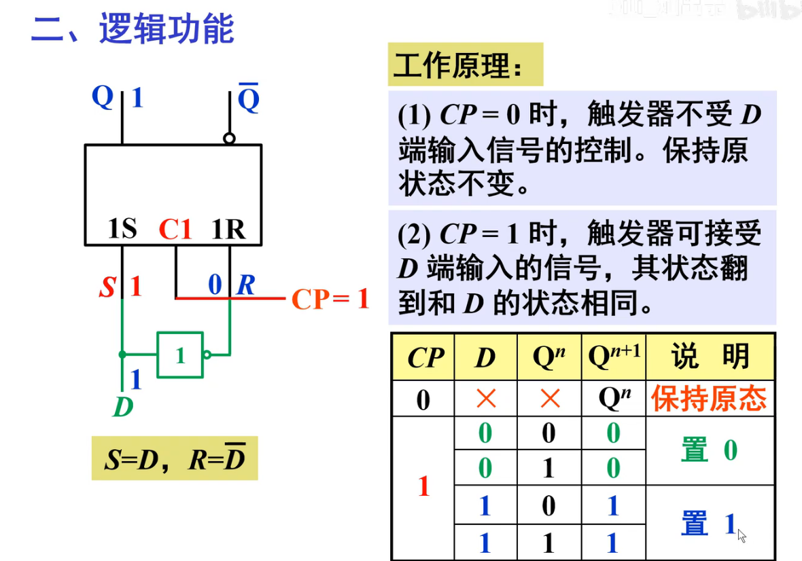

***

* 特性表,特性方程

***

* 状态转移图
  * ==**D = 0 , 置0 , D= 1 , 置1**==

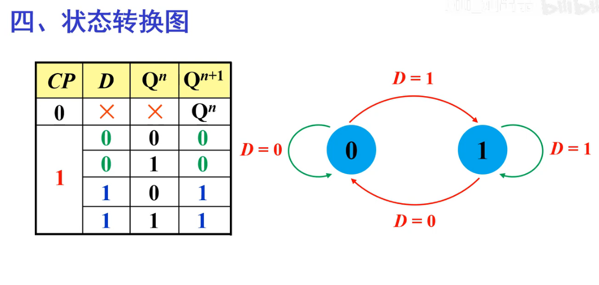

***

* 例题
  * 由于没有约束条件,所以Q和Q非完全相反,画图可以直接取反

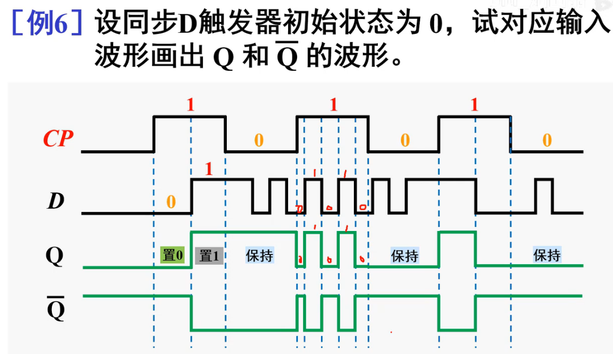

***

* 同步D触发器的特点

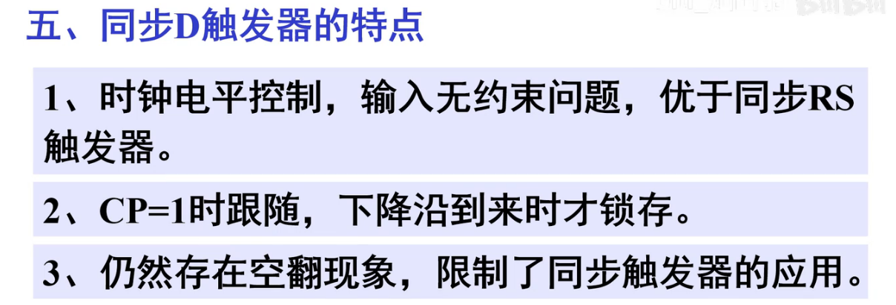

***

* 边沿D触发器异步端
  * 异步其实意思就是可以无视(优先级更高)CP使得输出为X(0/1)

***

* 芯片:74LS375
  * 公共端CP:自己看
  * 注意RS位置不同了,因为是或非门,**为的是保持D对应的是Q**

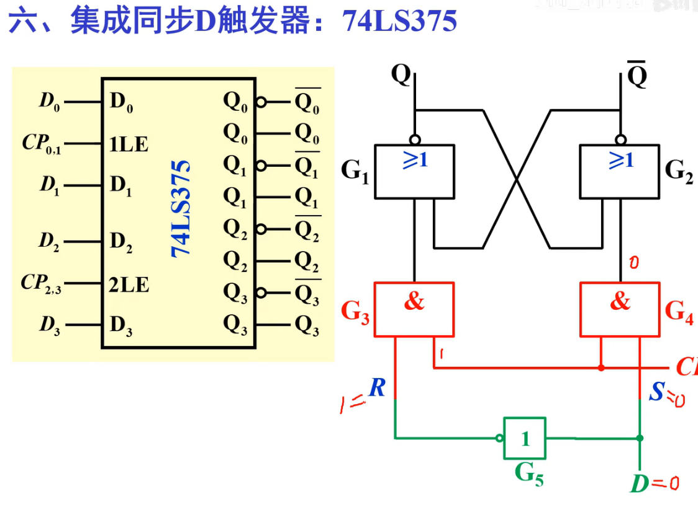

### 1-4 边沿JK触发器

* 电路组成
  * △代表边沿触发

***

* 工作原理
  * **下降沿触发**

***

* 特性表	
  * **下降沿很重要!!!**
  * **J K 不同时只看J即可,D = J**

***

* 例题

***

* 芯片:74LS112

* 特性表
  * R非和S非优先级很高,有效时覆盖CP,J,K
  * ==CP有圈代表下降沿触发==

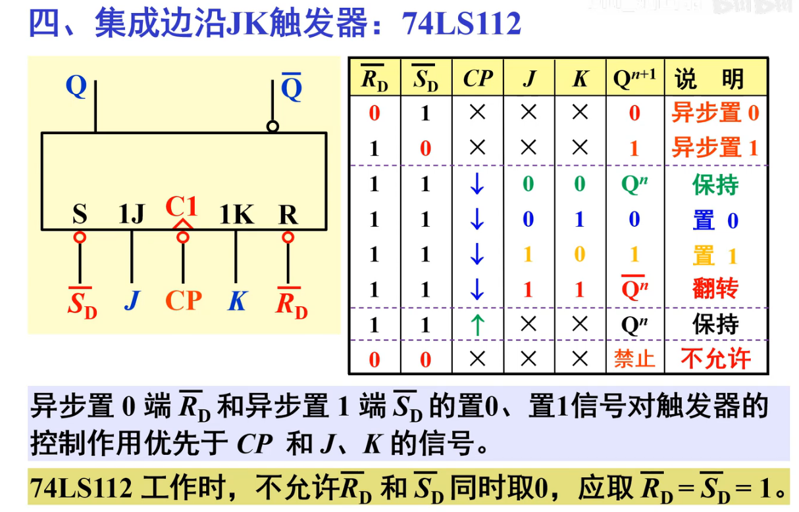

***

* 例题

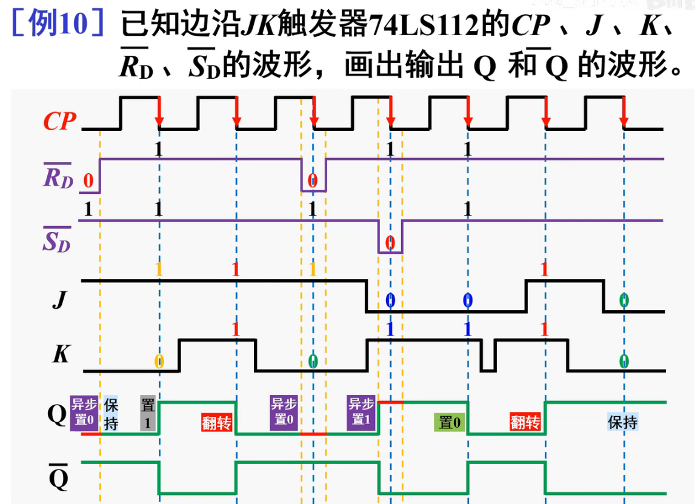

***

* 边沿JK触发器的特点

### 1-5 T触发器和T'触发器

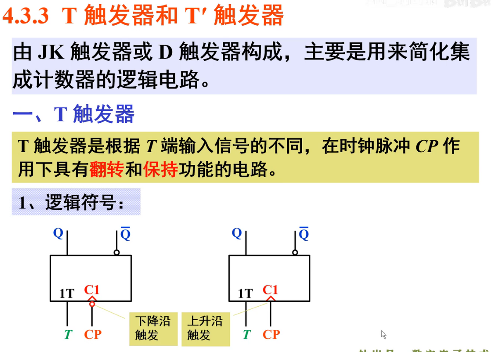

***

* 特性方程,特性表
  * T = 0 : 保持
  * T = 1 : 翻转

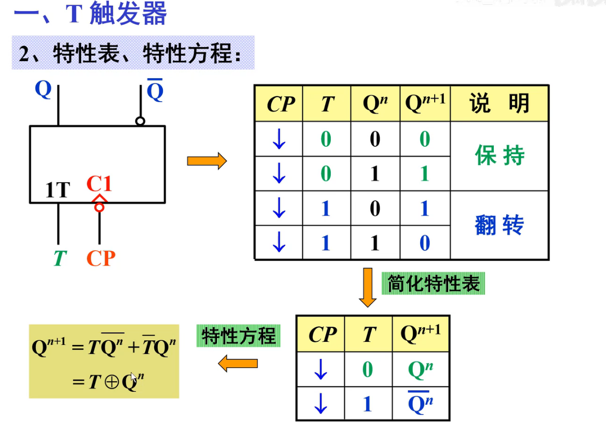

***

* 例子

***

* T'触发器

***

* 例子

