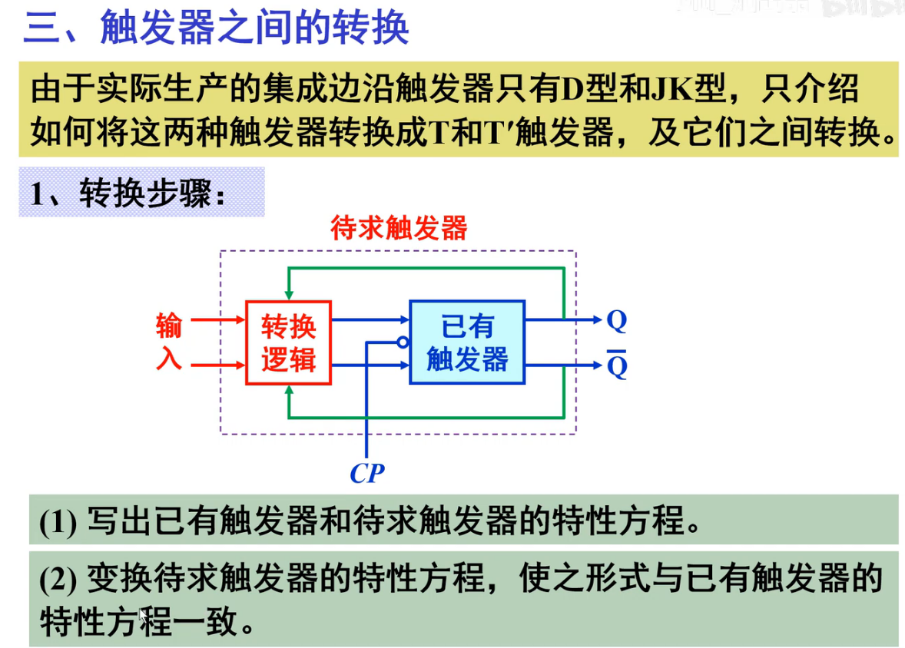
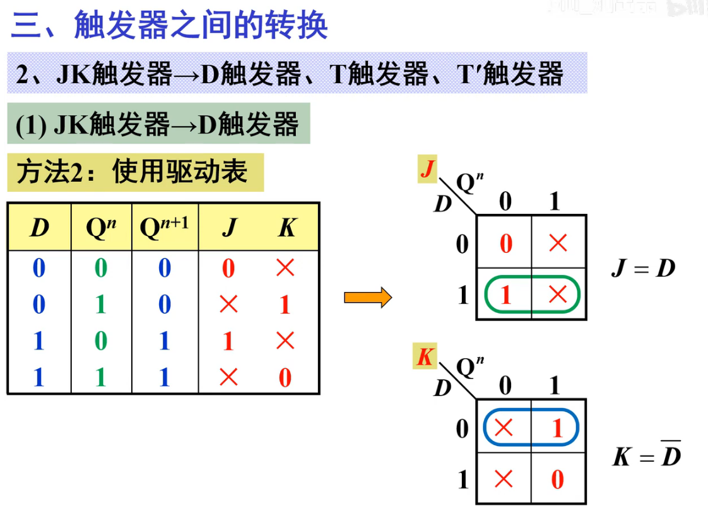
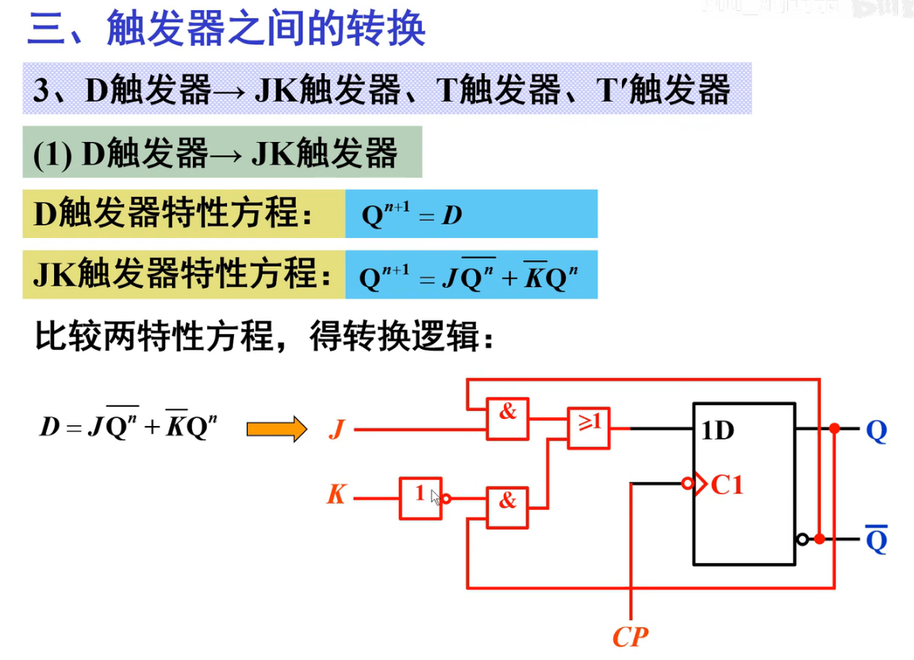

## 触发器之间的转换

[toc]

### 1-1 转换步骤

* **JK 转换为别的使用对照参数法**
* **D转为别的使用直接取等法**

### 1-2 JK --> D

***

* 方法2:使用驱动表

### 1-3 JK --> T

### 1-4 JK --> T'

### 1-5 D --> JK

### 1-6 D --> T

### 1-7 D --> T'

