# 半导体器件的开关特性

[toc]

## 1. 门电路的作用和常用类型

* 按电路结构
  * TTL
  * COMS

***

高低电平定义：略

## 2. 二极管的开关特性

* 半导体
  * 本征半导体
  * N型(negative)半导体（P）
    * 自由电子为多数载流子(negative)，空穴是少数载流子
  * P型(positive)半导体(B)
    * 空穴为多数载流子(positive)，自由电子是少数载流子

* PN结

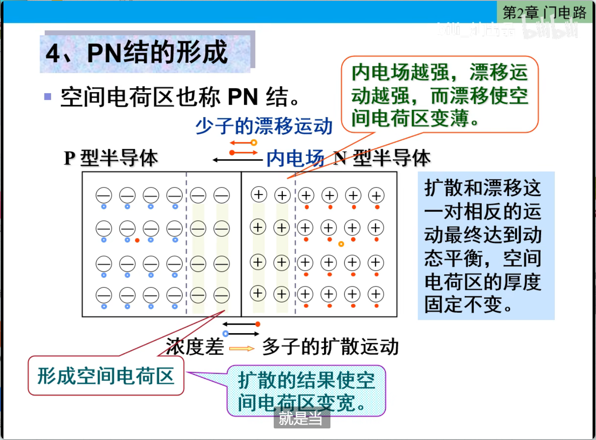

* PN结的单向导通性

  * 正向偏置
  * 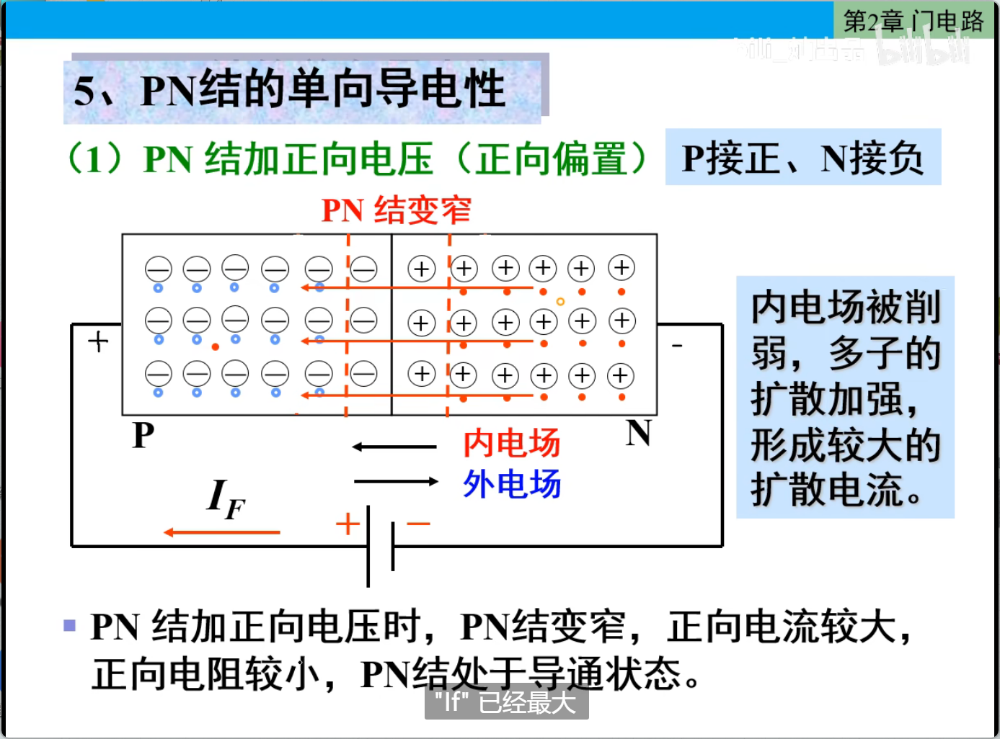

  * 反向偏置
  * 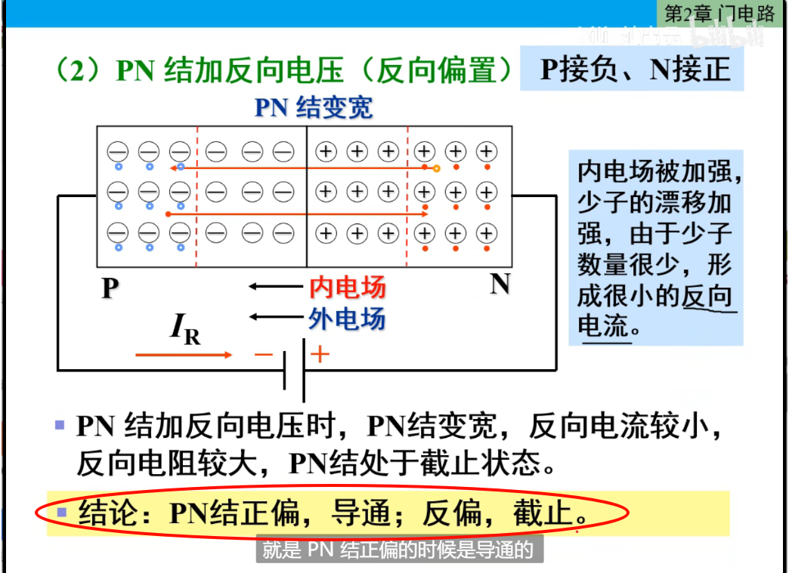

* 二极管

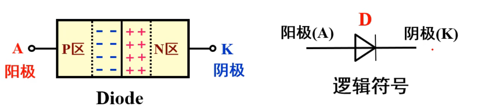

***

* 二极管的静态开关特性

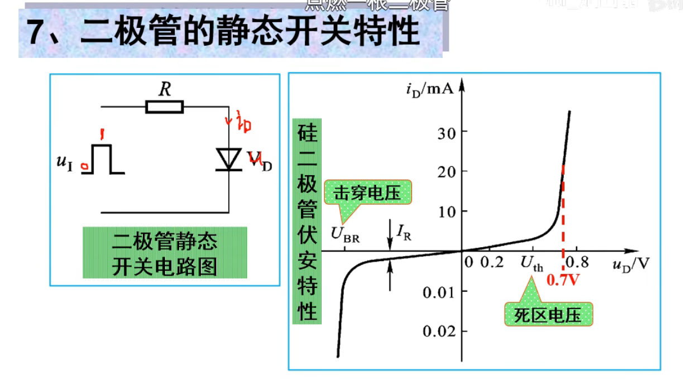

* 死区电压
* 正向压降(理想二极管看作导线，一般二极管看作0.7V压降电压源)

* 击穿电压

* 正向：当输入u为高电平U时，二极管正向导通，可等效为一个具有
  0.7V压降的闭合开关。

* 反向：当输入u为低电平Uu时，二极管反向截止，相当于开关断开。

* **开关特性**：==**(理想二极管忽略压降和死区)**==

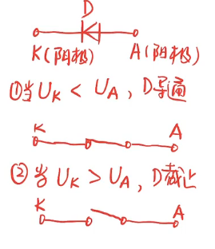

## 3. 二极管"限幅电路"

* 典型例题
* 例1

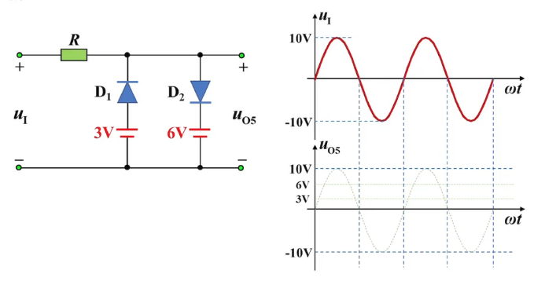

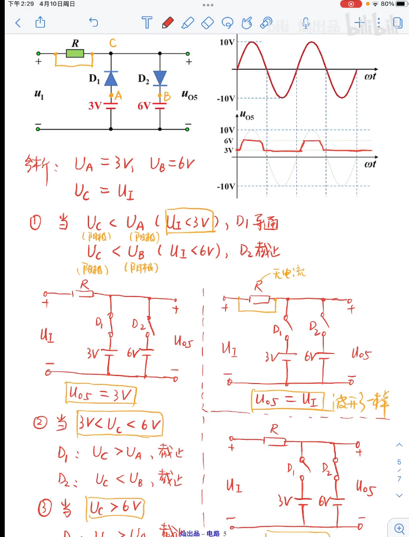

* 例2

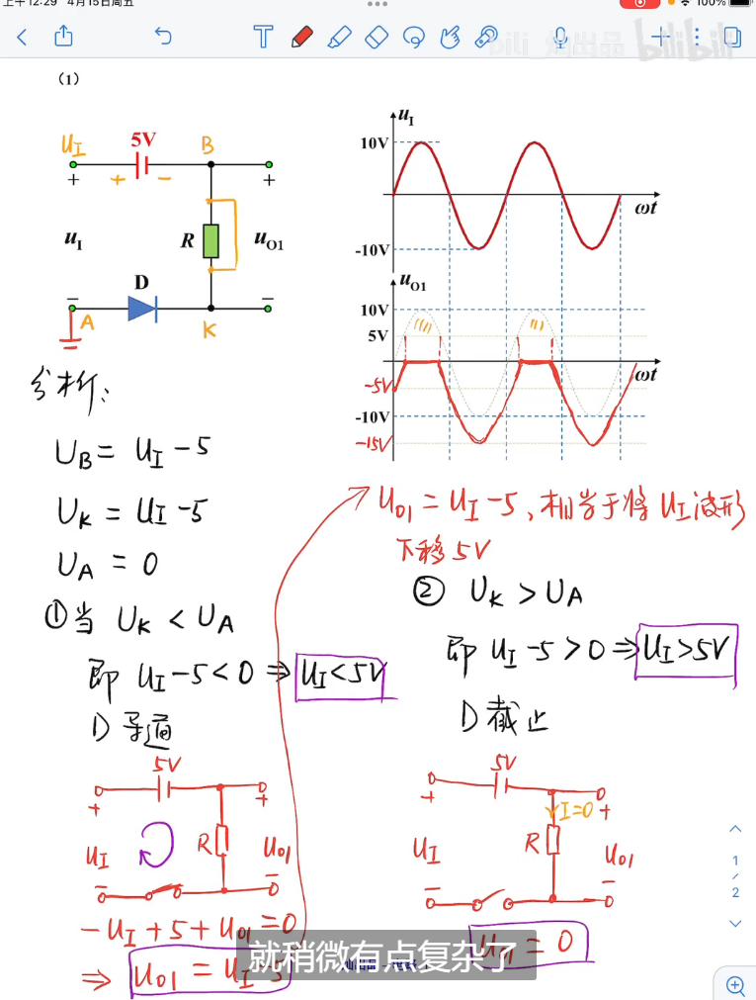

## 4. 三极管的开关特性

* 结构及逻辑符号
  * 判断PNP和NPN：P总是指向N

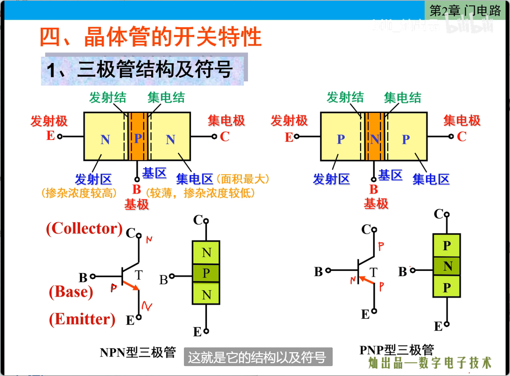

***

* 四种工作状态

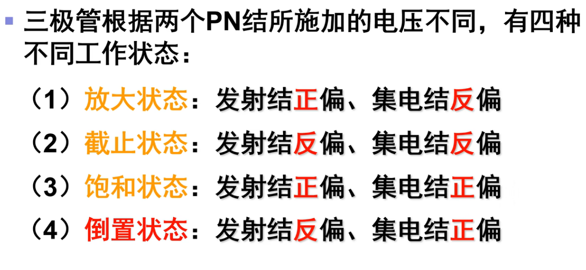

***

* 放大状态

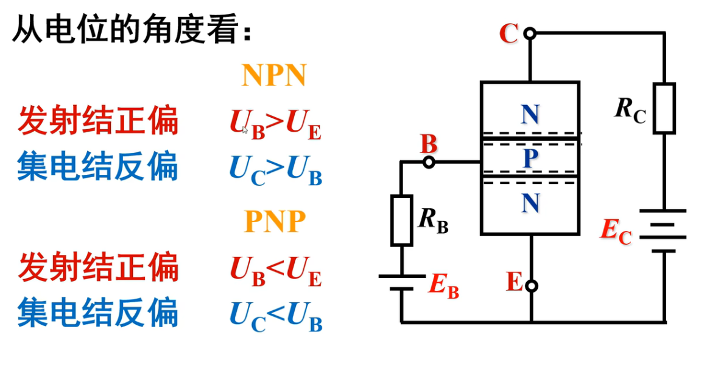

***

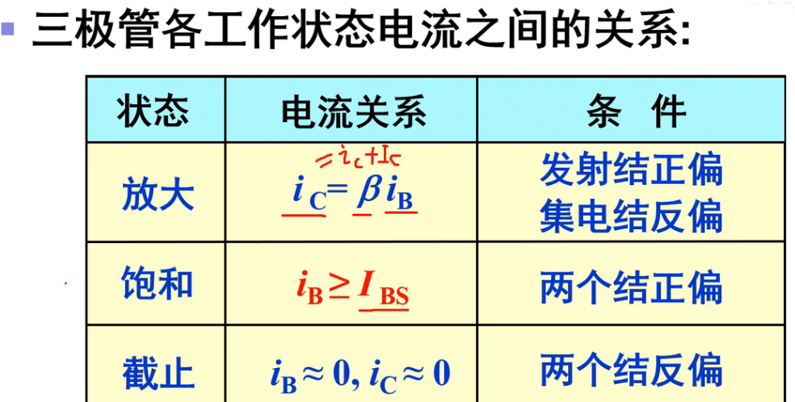

***

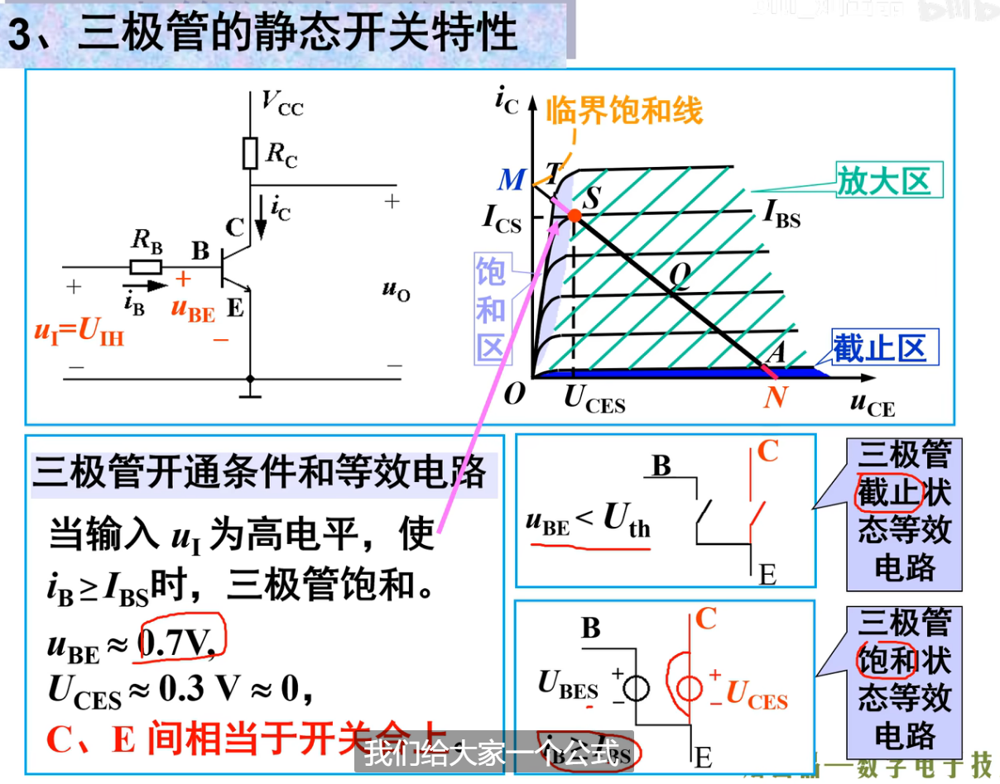

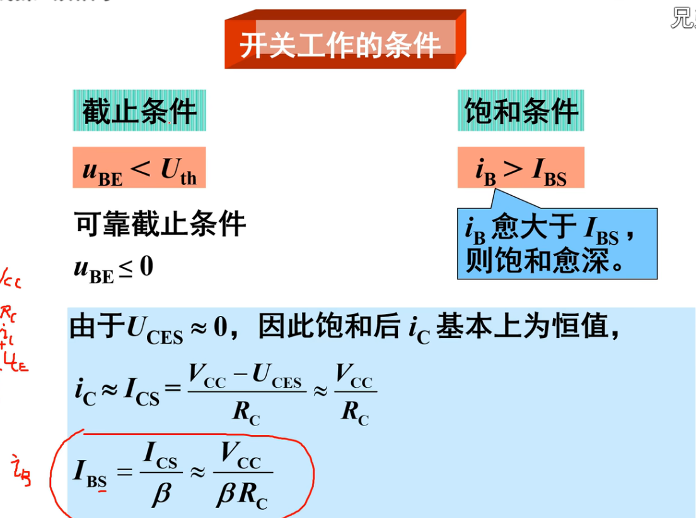

## 5. MOS管的开关特性

* 认识MOS分类

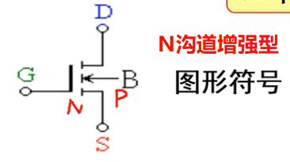

* 耗尽型：三虚线画成实现
* P沟道：箭头从P  ->  N ， 所以X在沟道计速X沟道

***

* 开关特性：看成水龙头
* **N沟道的G要接正电压才能导通**
  * N沟道增强型MOS管
  * 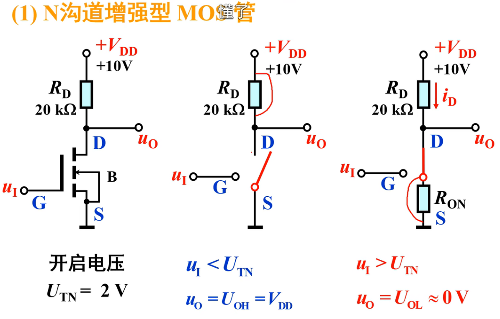
* **P沟道的G要接负电压才能导通**
  * 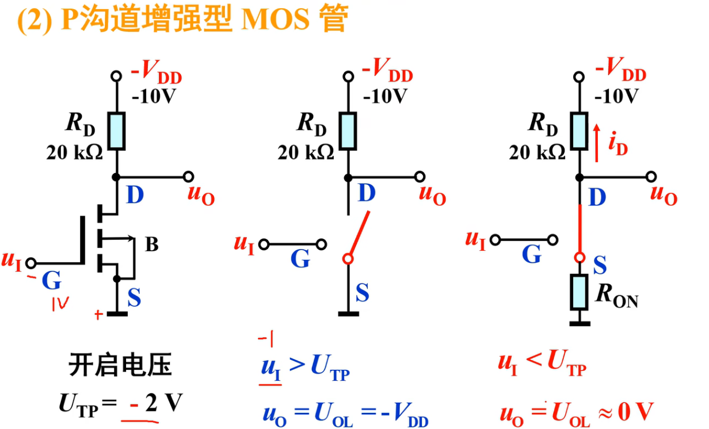
