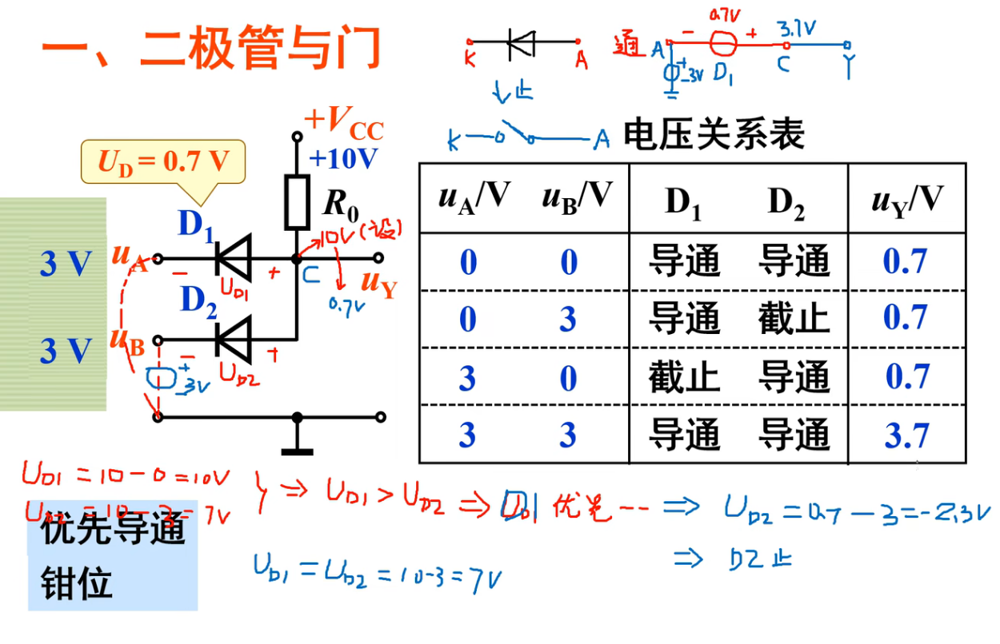
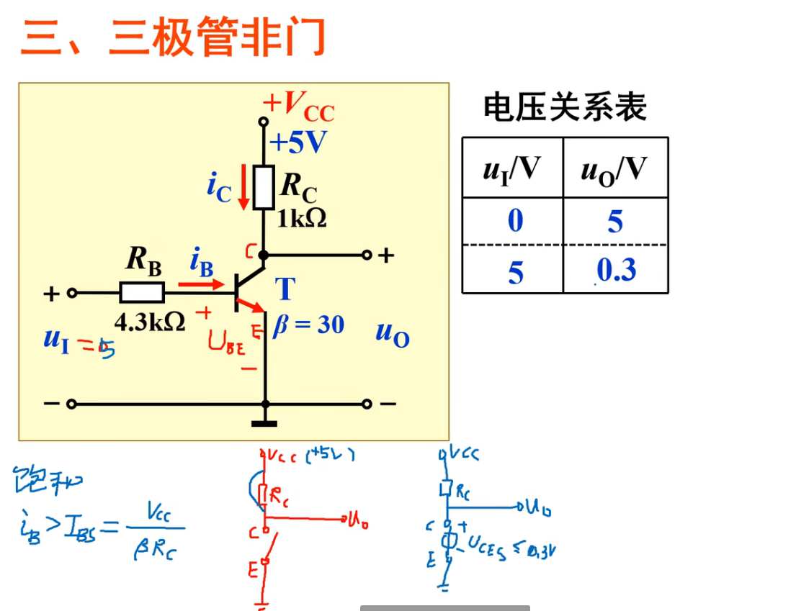

# 基本逻辑门电路

[toc]

## 1. 二极管与门

==分析二极管的导通与截止可以暂时忽略串联的电阻(视为短路)==

* ==重点：==
* 钳位：**二极管导通，那么必须满足左右电平差为压降电压(如0.7V)**，这就是钳位
  * 所以对于表第一行，先将R0视为导线，那么10V＞0V，导通，但是由于钳位作用，而GND不能更改，所以钳位之后C必须从10V改为0+0.7V，也就是0.7V
* 优先导通看更大的差值：
  * A = 0 ， B = 3V ， 同时导通，但是A升压10，B升压7，所以A优先导通，也就是D1导通，，产生钳位，所以C点点位为0.7V，导致D2截止，最后输出0.7V
* 同时导通同时钳位

## 2. 二极管或门

## 3. 三极管非门

