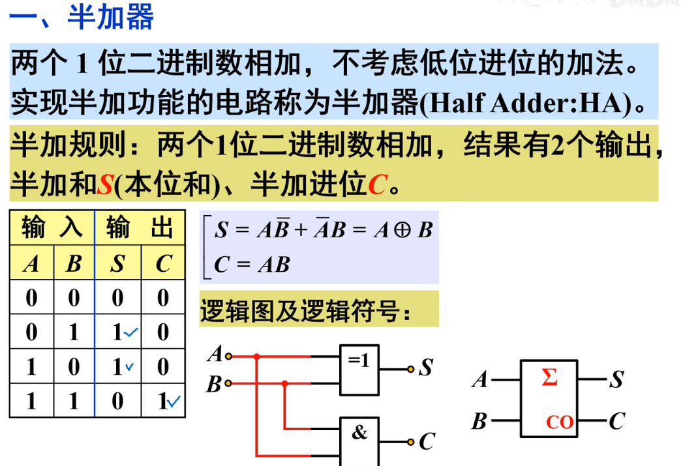
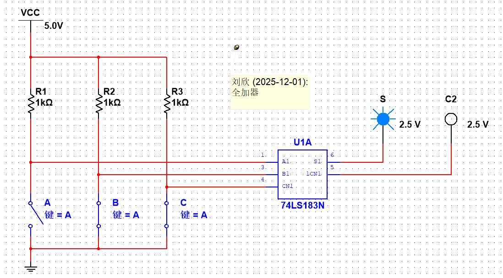
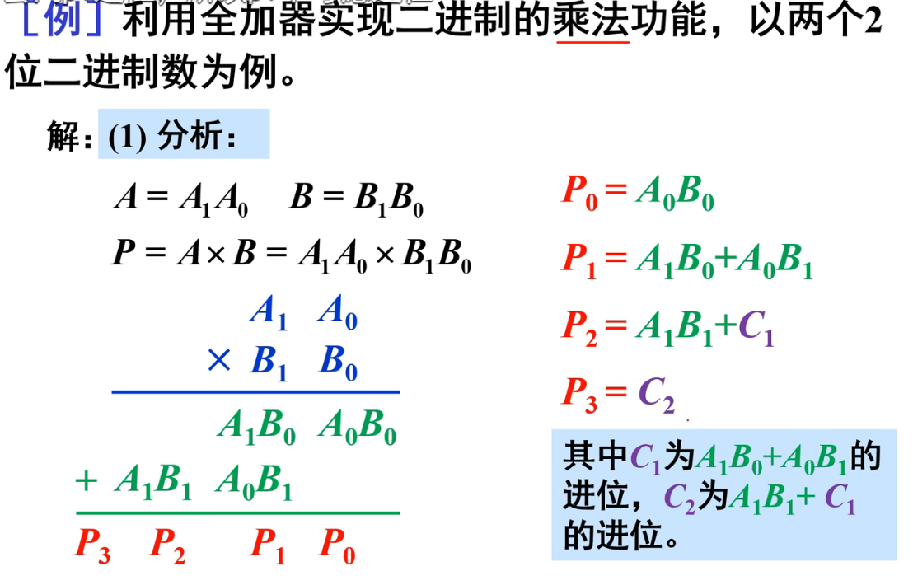
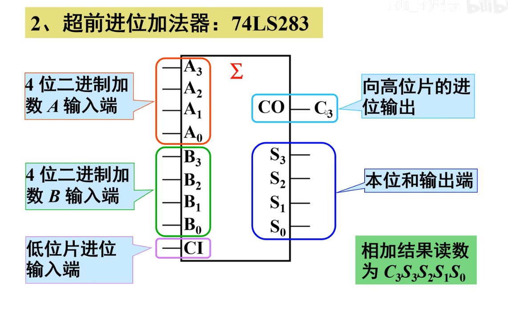

[toc]

## 3-2 加法器和数值比较器

### 3-2-1 半加器(1位)

* 介绍

### 3-2-2 全加器(1位)

* 简介

* 全加真值表(**这里的(A异或B)C = (A+B)C , 自己推**)

* **芯片:双 全加器**

我的仿真(一位数全加器)

### 3-2-3 使用全加器实现乘法器

* 分析

* 电路

- [ ] 仿真(待完成)

### 3-2-4 加法器(芯片实现多位加法)

1. 串行进位
2. 超前加法:如下

