## 中规模集成电路实现组合逻辑函数

[toc]

### 1-1 二进制译码器实现组合逻辑函数

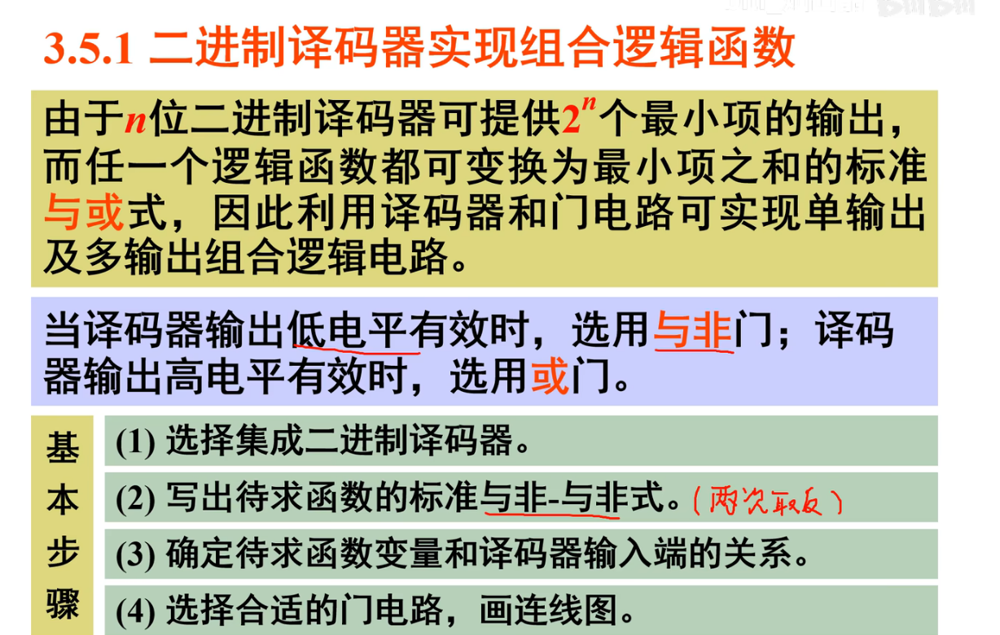

例1:

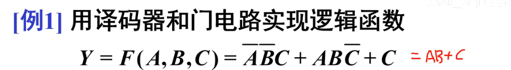

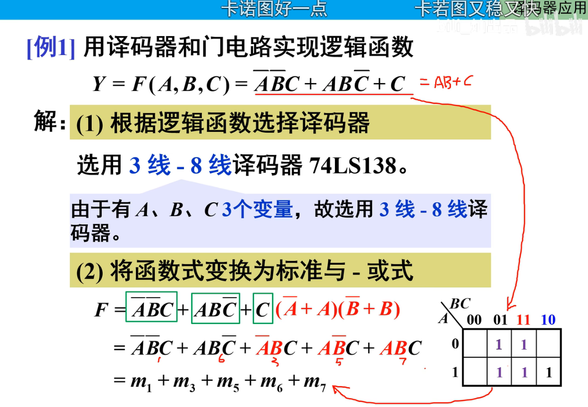

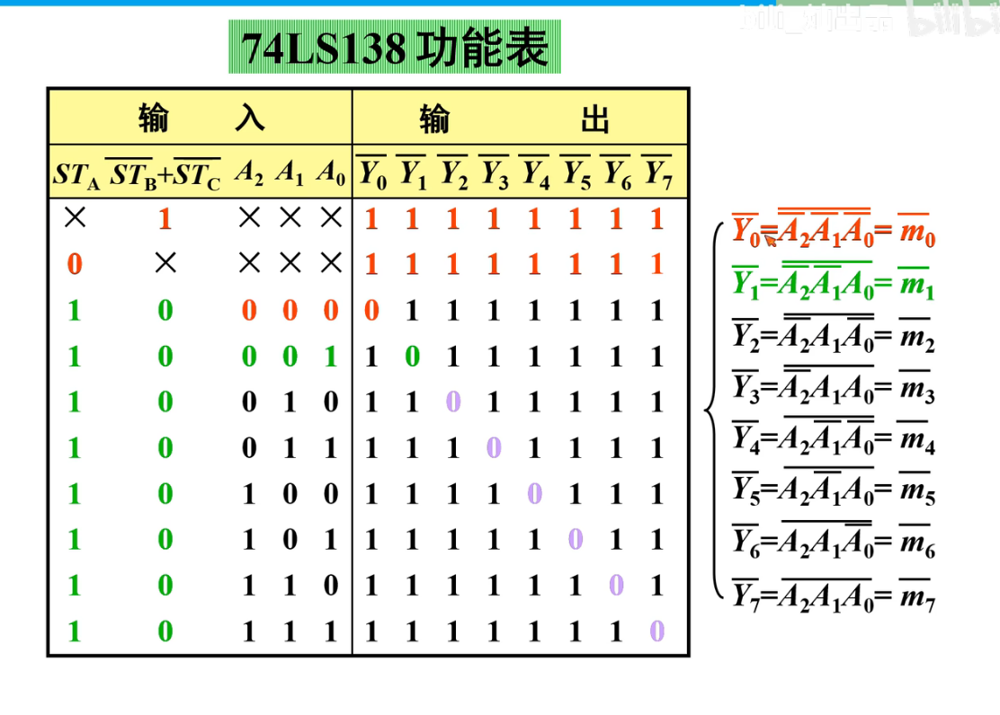

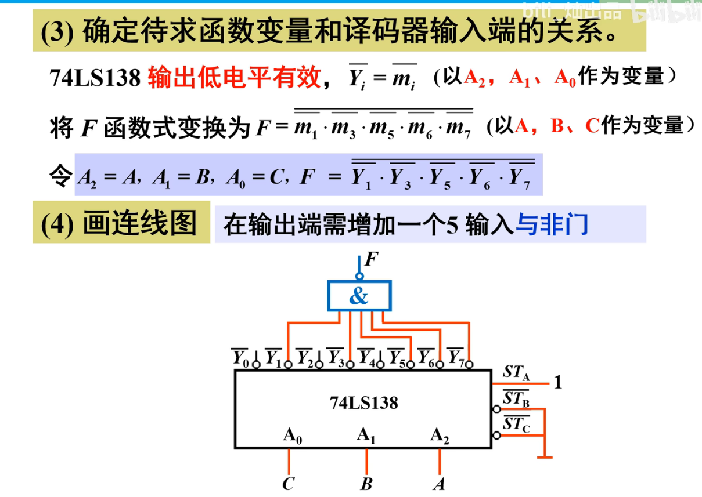

解读:

首先根据需要的逻辑表达式确定输入,选择了3线输入,已知3-8译码器可以用来表示3位所有最小项,所以肯定后续需要将F输出表示成最小项的样子,**但是3-8译码器输出的最小项都是取反了的**,导致m需要进行取反才能对齐输出的Y的反,因此==这里的m需要取反==

### 1-2 数据选择器实现组合逻辑函数

* 原理

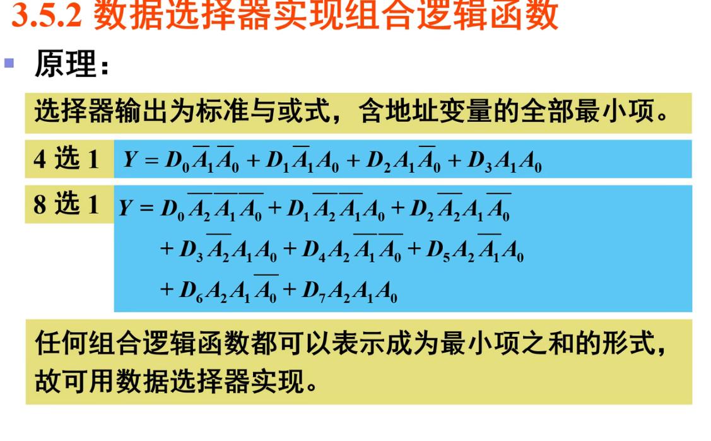

* 步骤

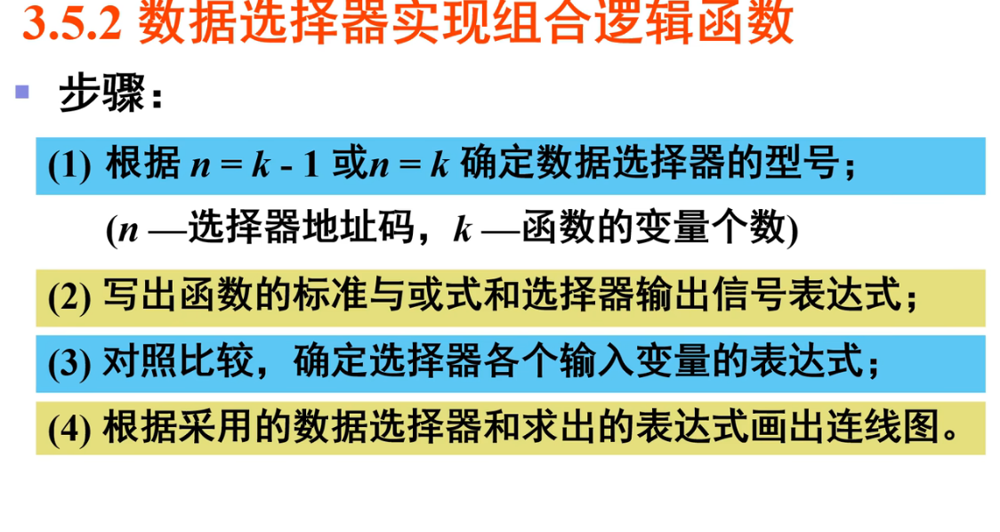

例:

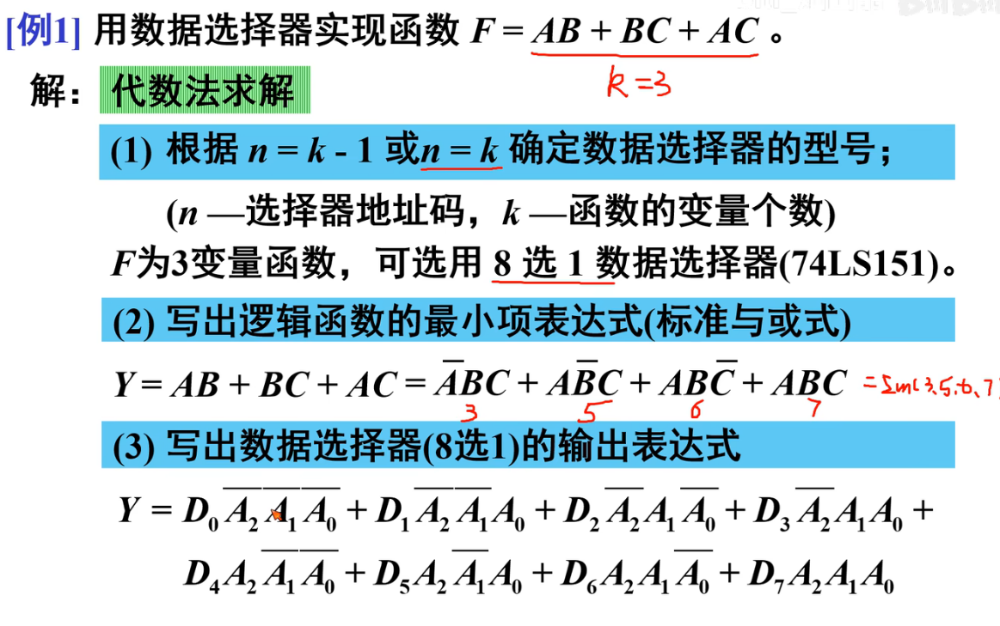

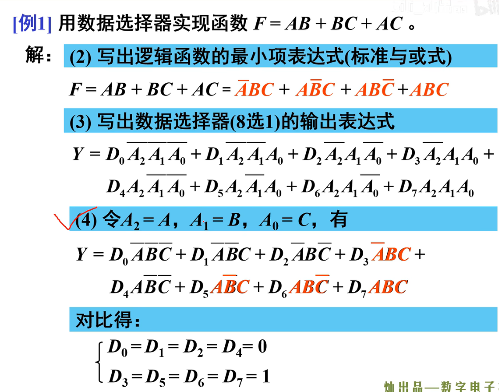

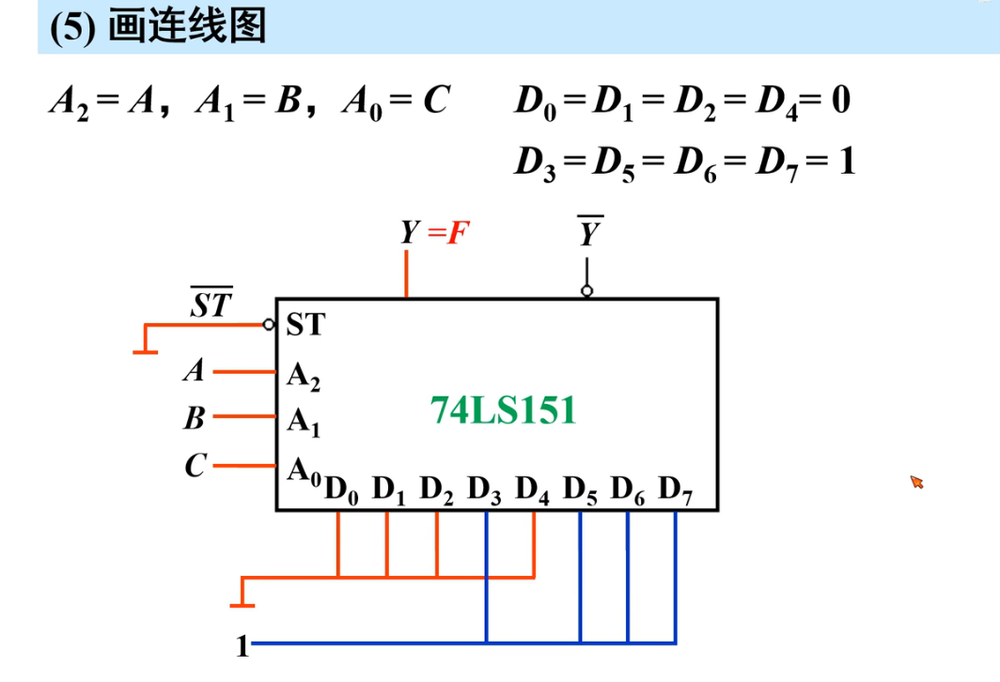

注:卡诺图法在将逻辑表达式转化为最小项中很好用:

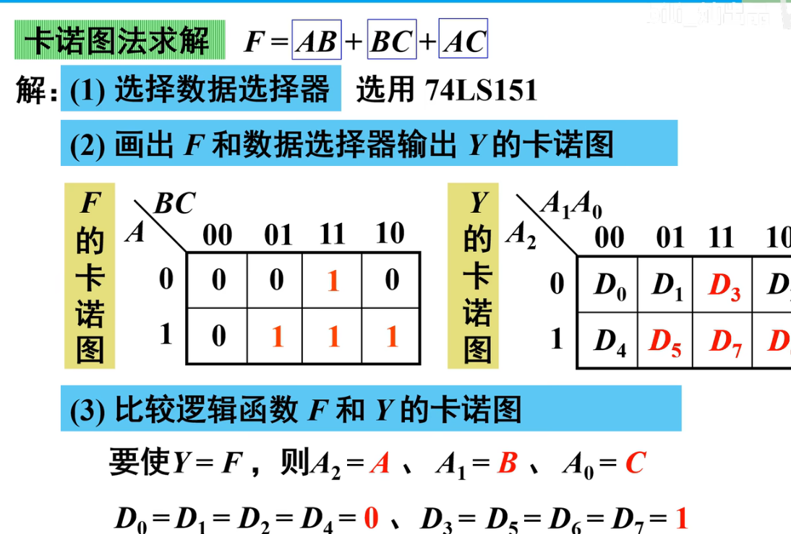

提高:

==使用4选1选择器实现上述题目==

* 这里需要用到降维的方法实现

* 方法1:公式拼凑法

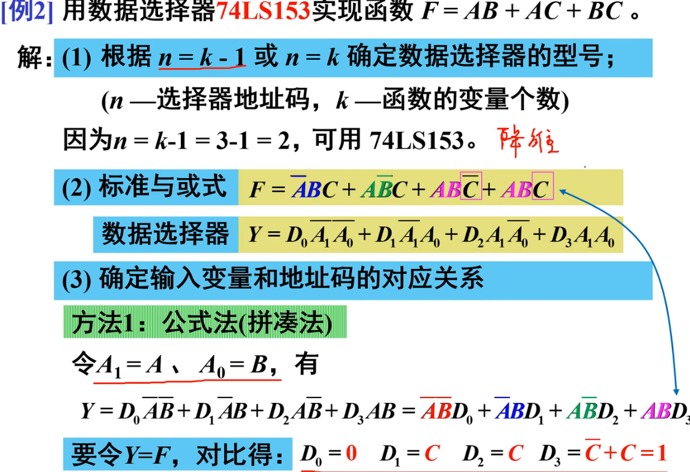

* 方法2:降维卡诺图法

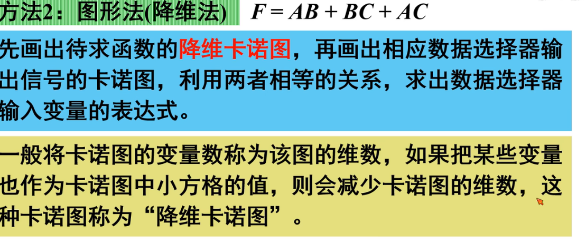

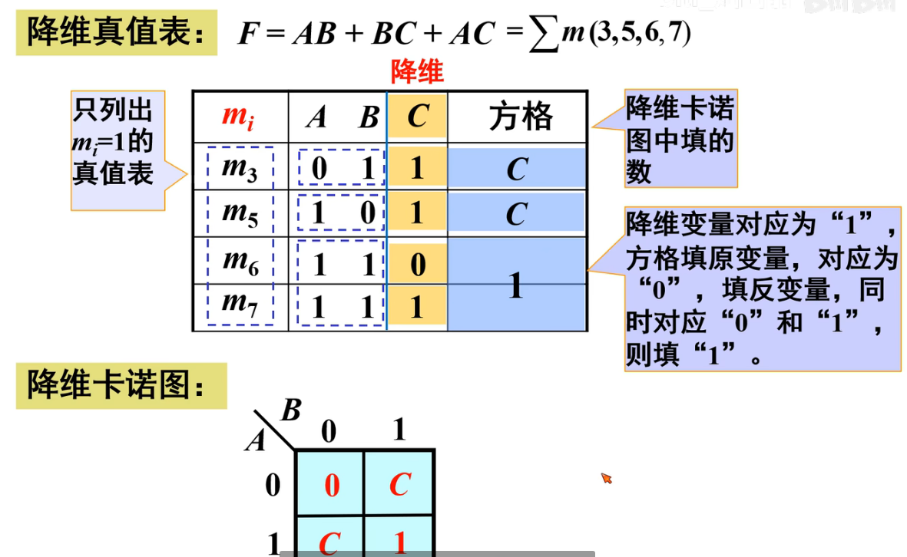

给个例子理解一下:

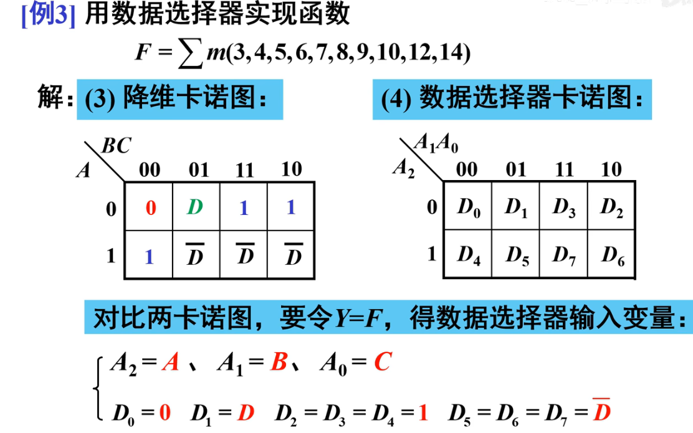

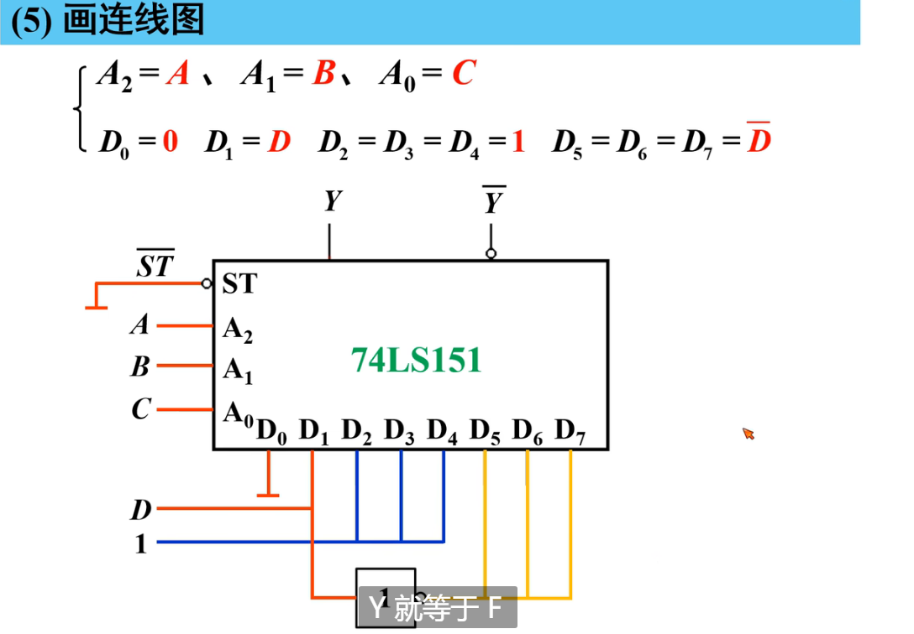