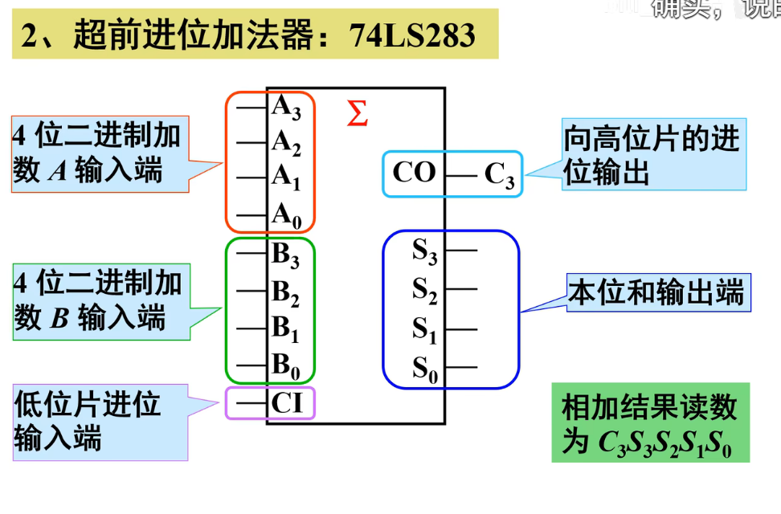
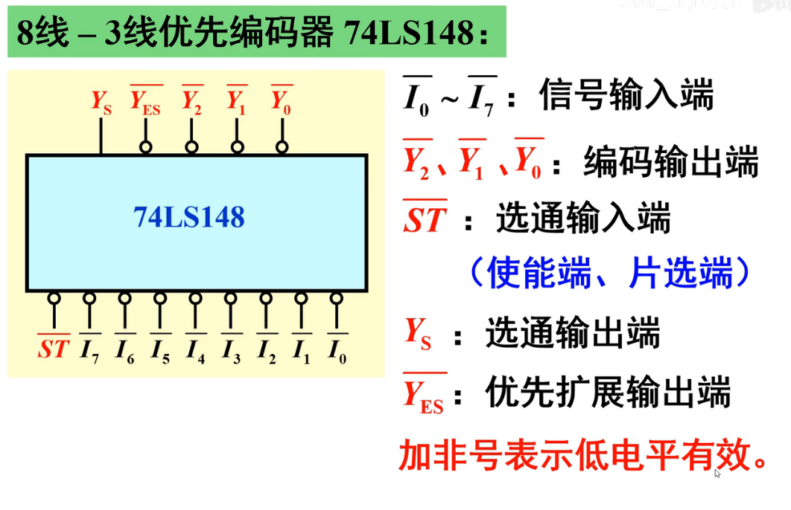
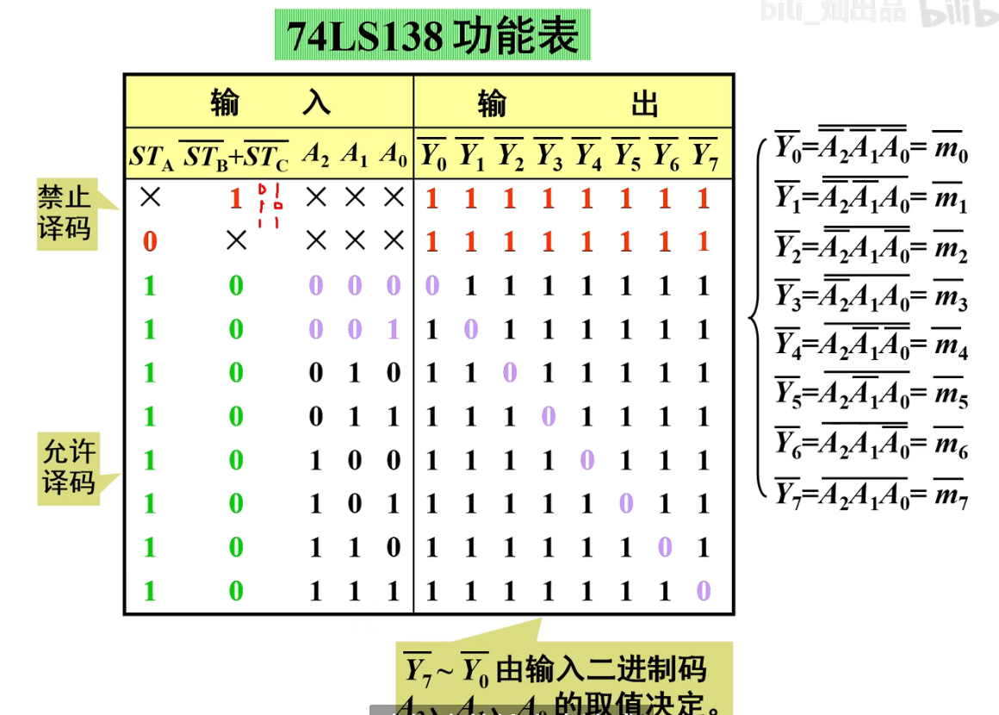
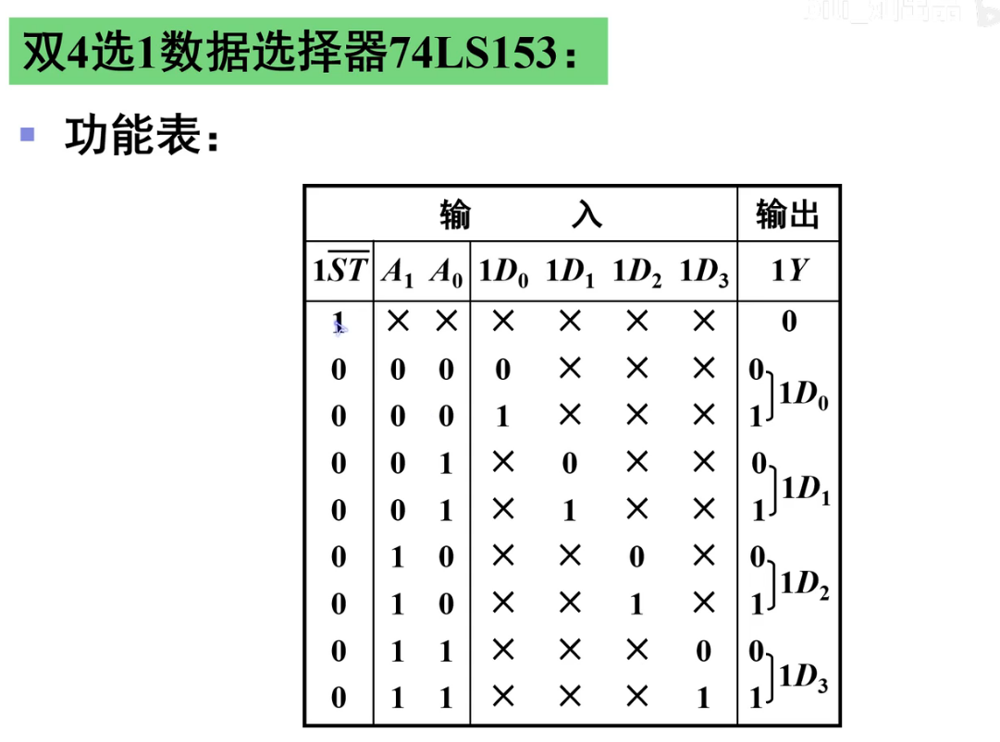
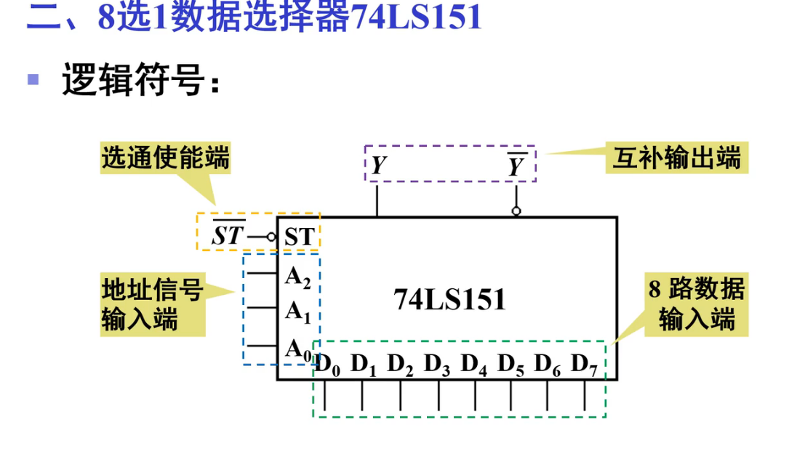

[toc]

### 1. 双全加器

### 2. 超前进位加法器

### 3. 4位数值比较器(可拓展)

* 注意:

### 4. 8-3优先编码器

==注:上面一个杠意思是低电平有效==

### 5. 10-4线优先编码器

* 功能表

### 6. 3-8译码器

### 7 2-10进制译码器

**这个芯片没有控制端**

### 8 数码管显示译码器

1. 74LS48

==注:74LS48内部有2k上拉电阻,可以不再外接,记得对应的是共阴极数码管==

优先级:

BI非/RBO非(全灭) > LT非(全亮) > RBI非(消隐-全灭)

2. CD4511

### 9. 双4选1数据选择器

==注意:地址端是共用的==

### 10. 八选一数据选择器

* (74LS151)

