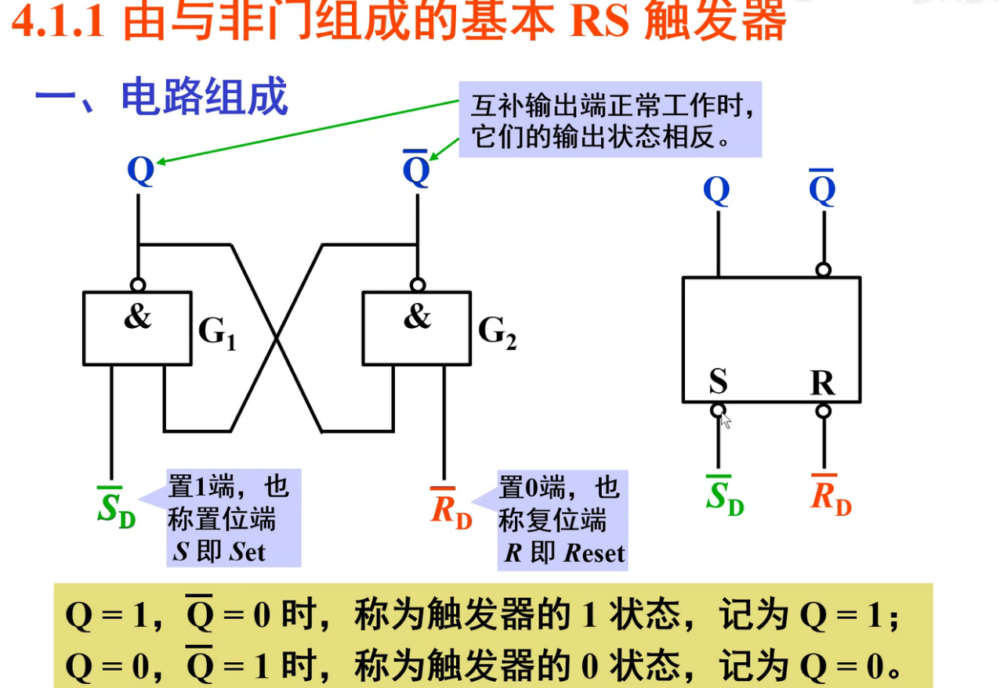
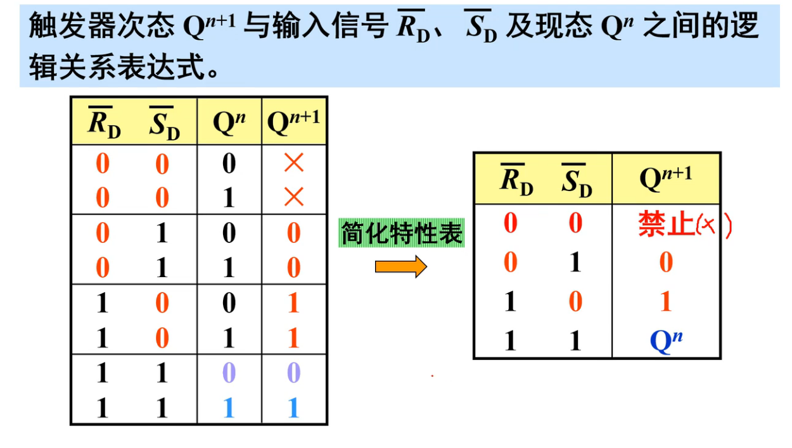
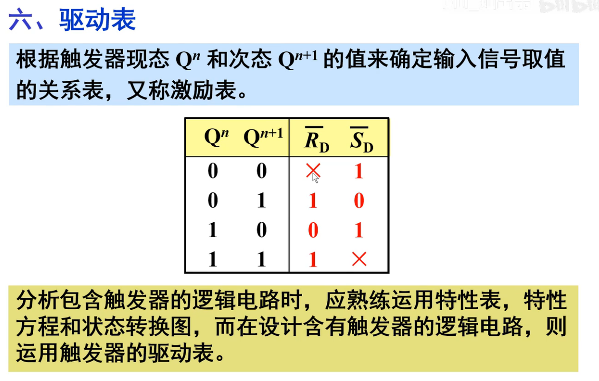
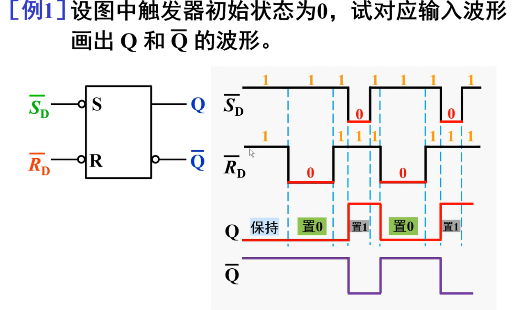
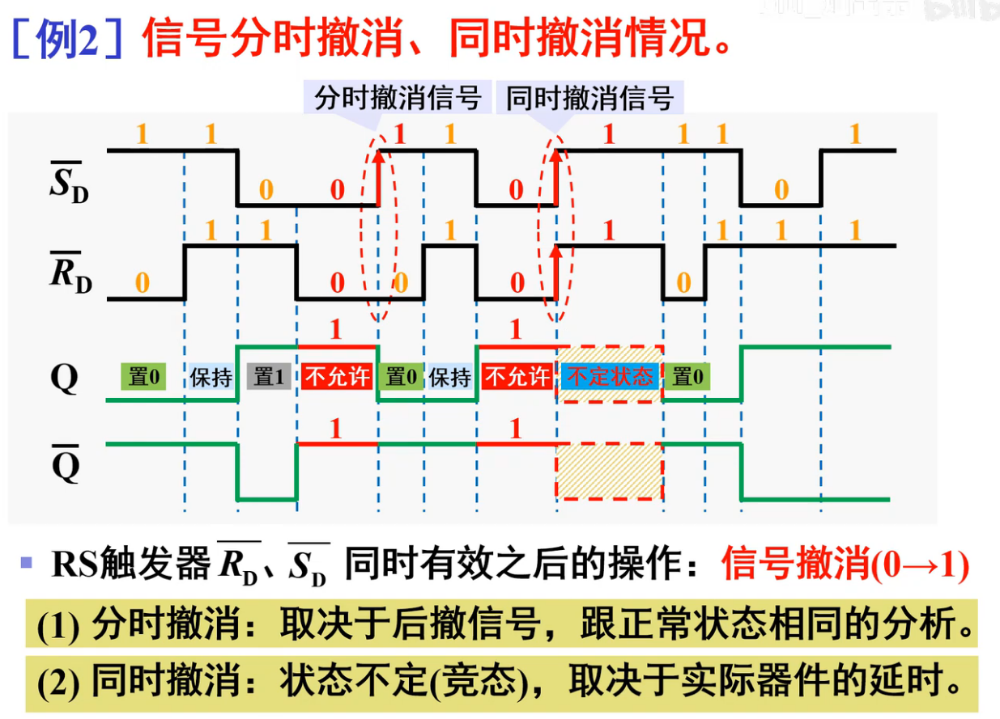

## 基本触发器

[toc]

### 1-1 由与非门组成的基本RS触发器

* 电路组成
* Q表示触发器状态(置0 / 置1)

* 逻辑功能

* 注意在与门中 , 0的优先级比1高,所以有0就先计算0
  * 可以分析一下 1 1 和 0 0 状态
  * **约束条件:两个输入不能同时为0,否则这样的话Q和Q非都是1,不满足互补条件!**

* 记忆方法:
  * R表示Reset,取非了,那么R非 = 0表示有效,那么复位表示0,所以 0 1 对应触发器置 0
  * 1 1 不变 , 毕竟Reset和Set都没有发作 , 那就保持原状呗
  * 0 0 不被允许 , 因为Reset和Set同时起作用...肯定不行:cry:

* 特性表

*  简化特性表

* 特性方程

* 状态转换图
  * 注:状态转移图的×为"任意状态"

* 驱动表

例题

* 例1:

* 例2:

  * 绘制Q和Q非**需要同时画**(因为出现信号1  1的情况会导致Q和Q非都是1,也就是不相等,所以同时画避免惯性取反)

  * 分时撤销和同时撤销题目
    * 分时撤销:取决于后撤信号
    * 同时撤销:**产生不定状态**需要看实际的电路状态,所以在绘制波形图画虚矩形
  * ==记得撤销之后才会出现特殊情况,撤销前是属于禁止状态(Q和Q非都为1)==

### 1-2 由或非门组成的基本RS触发器

* 电路组成
  * 注意与与非门不同的是==R 和 S 高电平有效==
  * **同时Q对面的器件也改了, 与非门对面的是S非 , 或非门对面的是R**

***

* 逻辑功能
  * 优先级:**或非门中:1优先级高:smile:**
  * 记忆方法:
    * ==同样是R有效置0,S有效置1==,所以 0 0 对应不变 , ......
    * 1 1 表示同时R + S , 所以禁止 , 不允许! , **但是Q和Q非都是0**

***

* 特性表

***

* 特性方程

***

* 一道例题
  * 同时撤销和分时撤销和1-1一样的
  * **记得处于不允许时,Q和Q非都是0(1-1为1)**

***

### 1-3 总结

* 电路形式对比 + 特性表对比

***

* RS触发器的优缺点

### 1-4 集成基本RS触发器

* 芯片:COMS集成基本触发器:CC4044

* TTL: 74LS279
* 1 , 3有不同,其实作用等价,可以看做为或门连接,也就是激活任意一个即可

