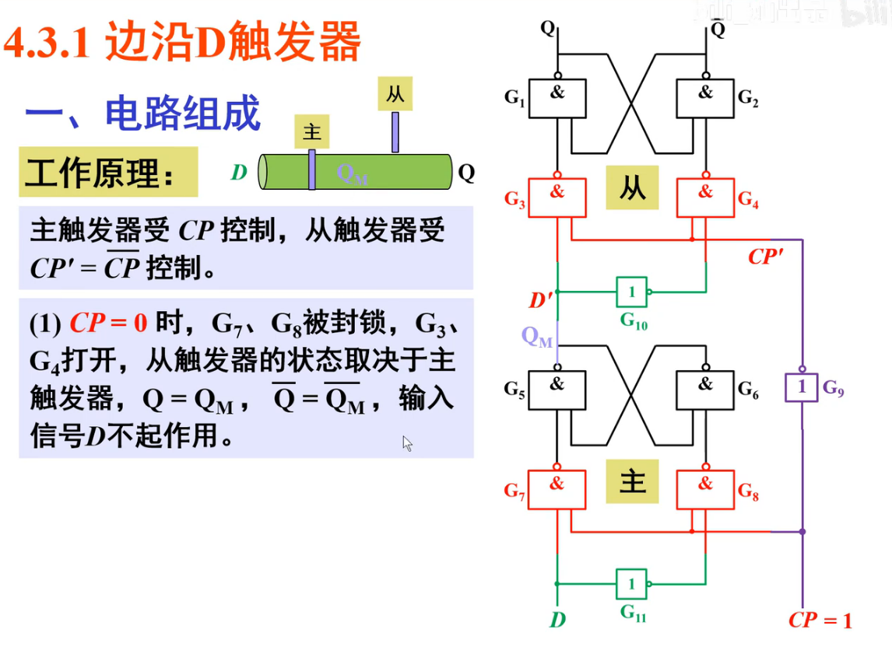
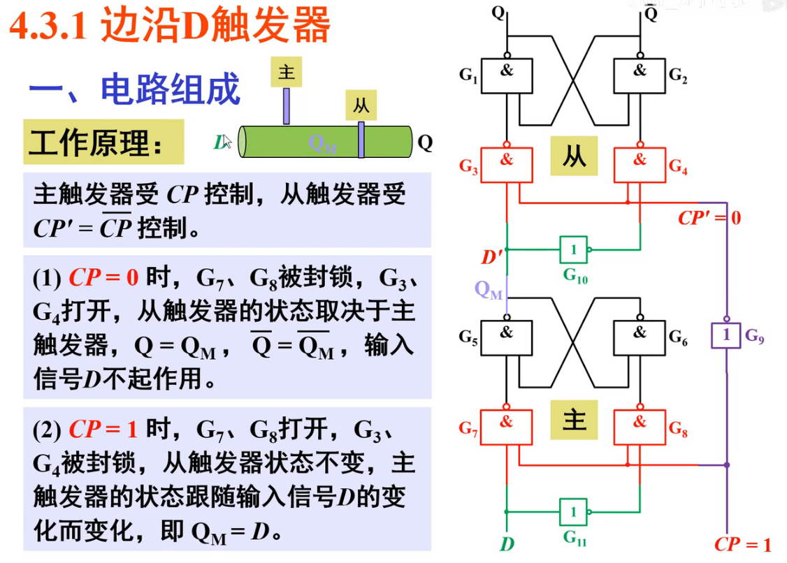
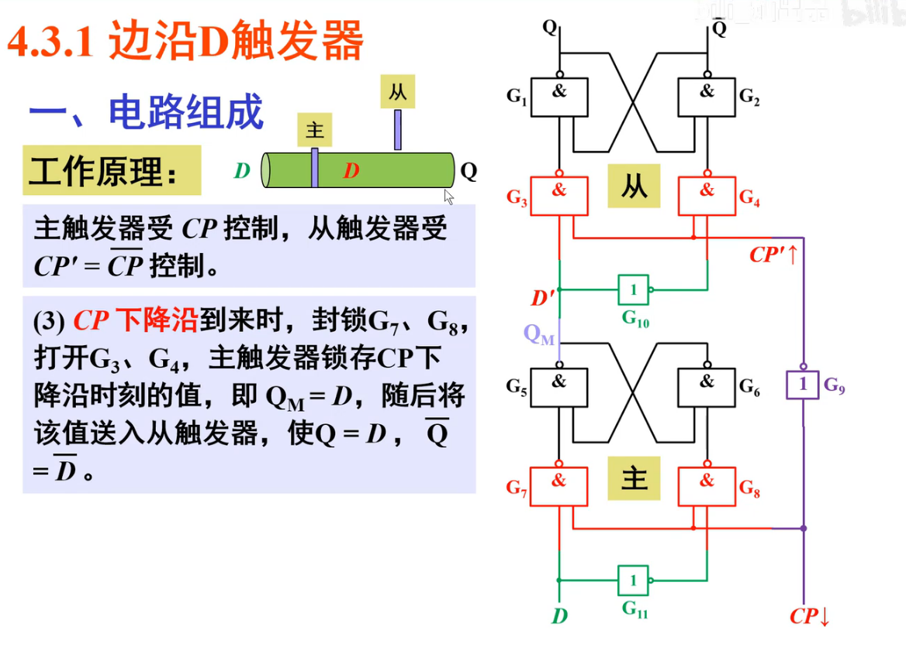
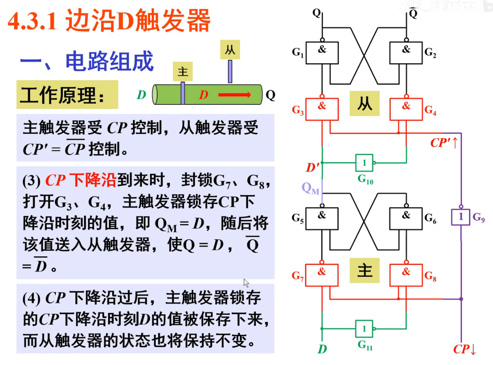
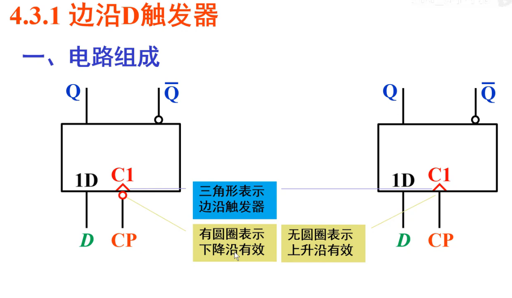
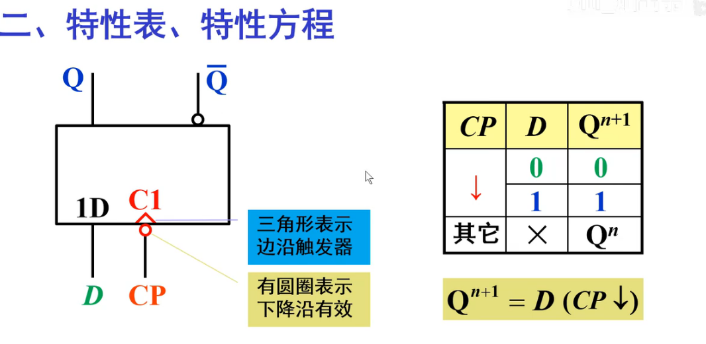
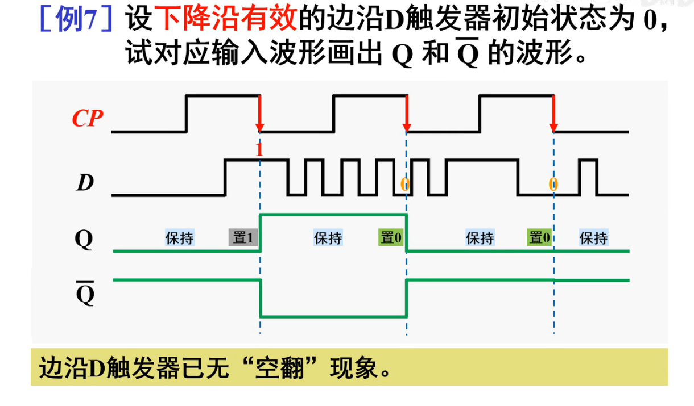
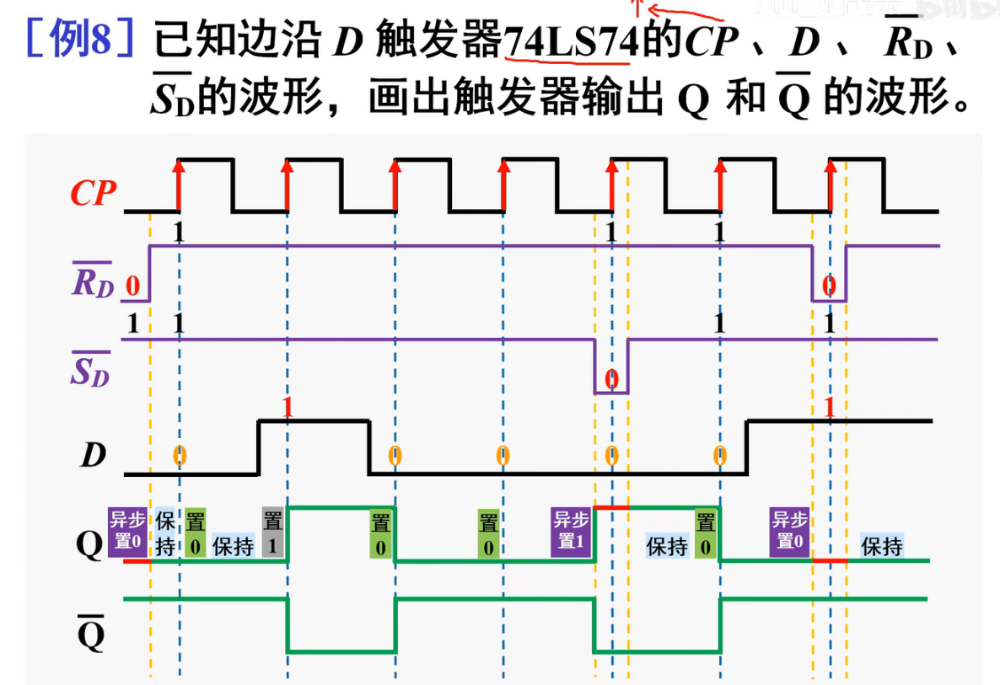

## 边沿D触发器

### 1-1 电路组成

* 工作原理

  * CP = 0时
    * 主触发器无法得到外部D的变化
    * 从触发器输出Q
  * 

  * CP = 1 时
    * 主触发器工作(接收外部信号D) , QM = D
  * 

  * ==**CP 下降沿**==
    * 看做CP = 0的电路(如果是1那什么都没变,分析个蛋)
      * 那么Q从QM读值,实现更新
  * 

  * CP下降沿过后(CP = 0)
    * 下降沿的时候已经读取值了(锁存),所以后续CP(非下降沿)也无法读取别的D了
  * 

***

* 电路组成

***

* 特性方程,特征表

***

* 例题

***

* 芯片:74LS74
  * S非和R非都是低电平有效(**异步**)

***

* 例子

