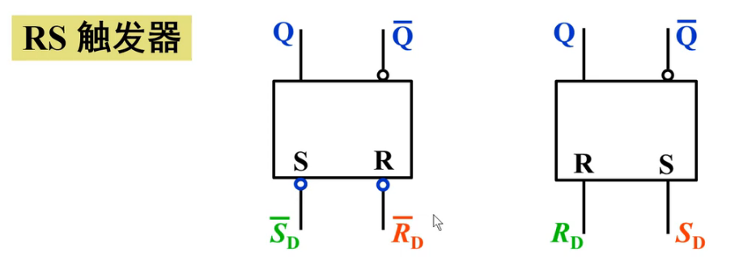
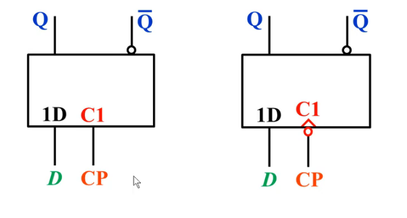

## 触发器总结

[toc]

### 1-1 特性方程

### 1-2 逻辑符号

* RS触发器
  * 区别在于"高有效"or"低有效"
  * **但是无论如何,R有效对应复位 , S有效对应置位**
  * CP 忘记画了

***

* D触发器
  * 同步触发
  * 边沿触发

***

* JK触发器

***

* T触发器 & T'触发器

### 1-3 常考题型

* 触发器之间的转换
* 绘制波形

