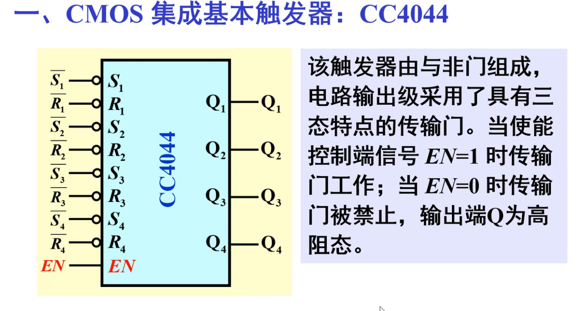
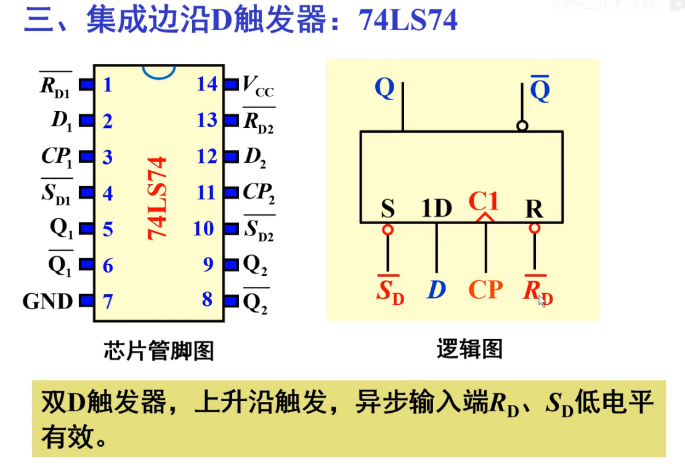
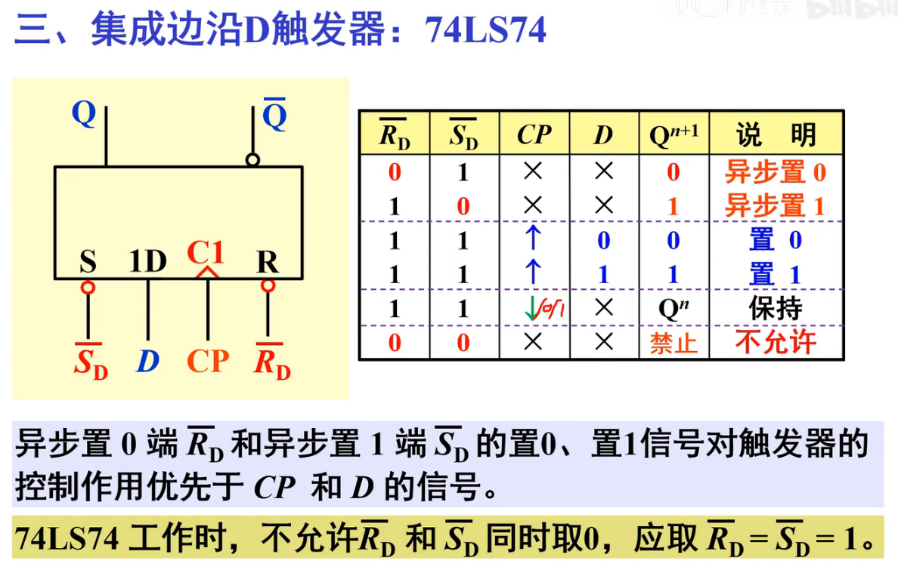

[toc]

## 1. COMS集成基本触发器:CC4044

* 芯片:COMS集成基本触发器:CC4044

## 2. TTL集成基本触发器:74LS279

* 1 , 3有不同,其实作用等价,可以看做为或门连接,也就是激活任意一个即可

## 3. 集成JK边沿触发器

* 特性表
  * R非和S非优先级很高,有效时覆盖CP,J,K
  * ==CP有圈代表下降沿触发==
  * 

## 4. 集成同步D触发器

* * 公共端CP:自己看
  * 注意RS位置不同了,因为是或非门,**为的是保持D对应的是Q**

## 5. 集成边沿D触发器

* * S非和R非都是低电平有效(**异步**)

