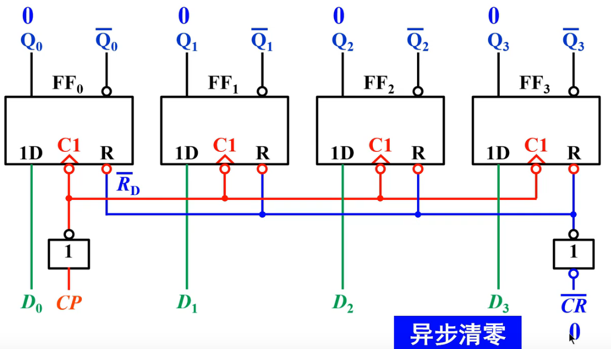
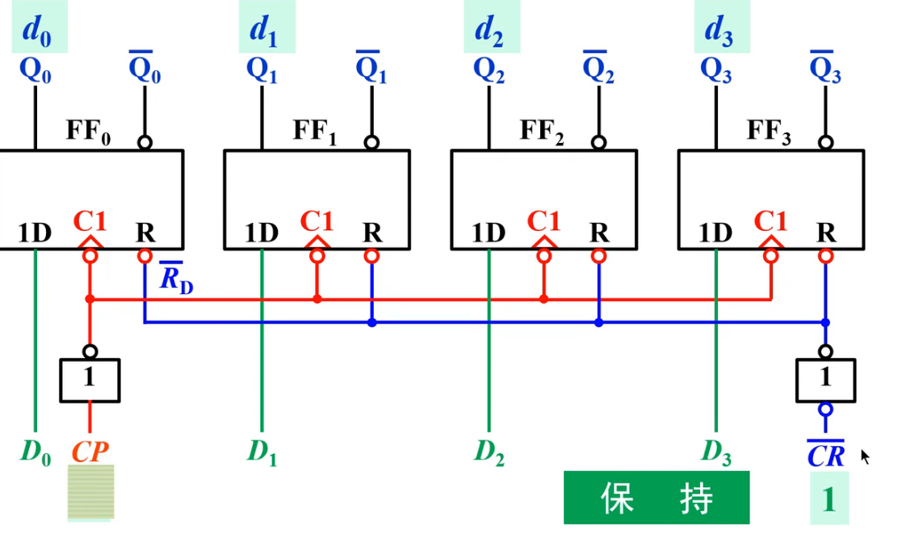
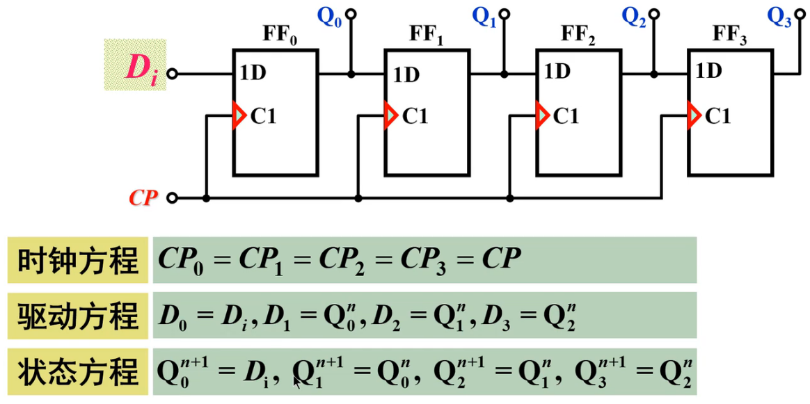
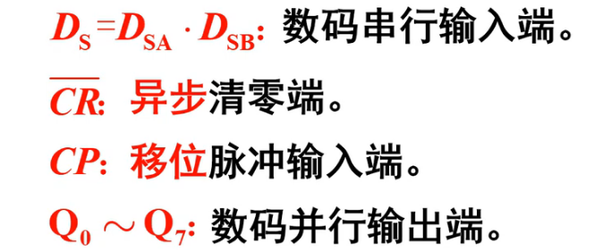
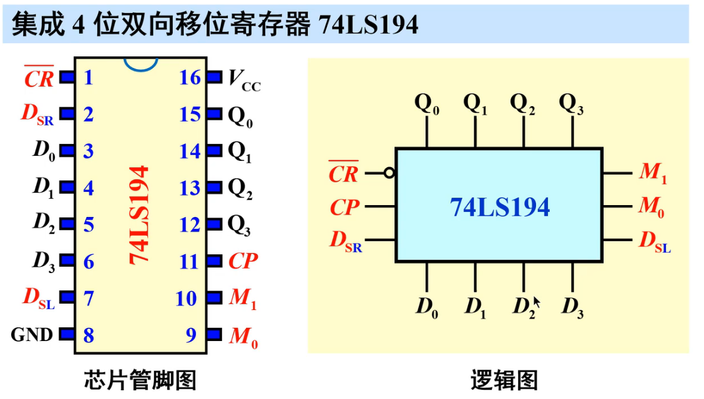
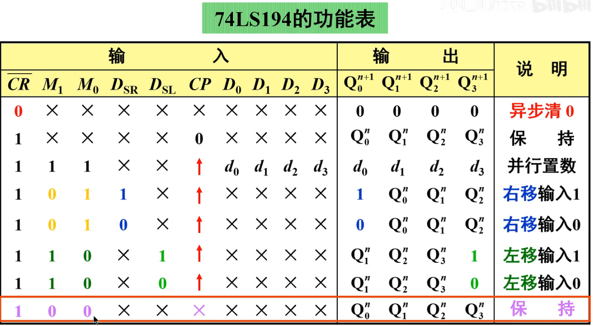
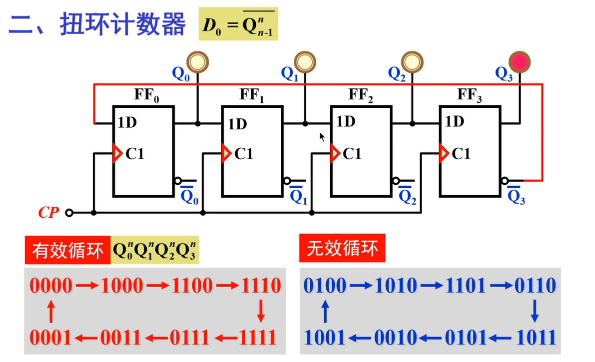
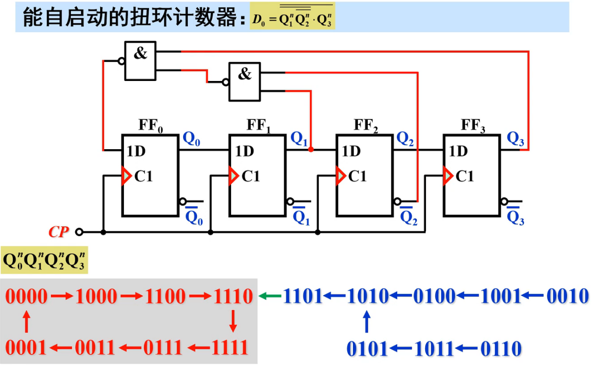
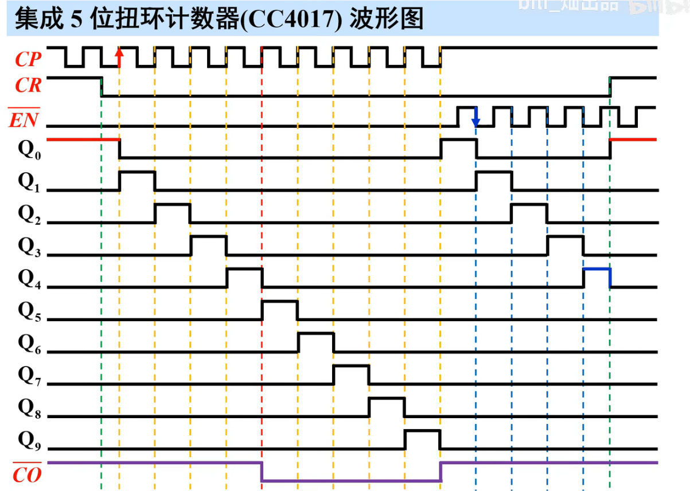

[toc]

## 1. 寄存器的作用与分类

* 寄存器（Register)的概念寄存
  寄存器把二进制数据或代码暂时存储起来。具有寄存功能的电路。

* 寄存器的特点

  主要由触发器构成，一般不对存储内容进行处理。每个触发器只能记忆一位二进制信息，如果存放n位二进制信息，则需要n个触发器。

* 分类
  * 基本寄存器 : 并入并处
  * 移位寄存器 : 并入并出、并入串出、串入并出、串入串出

## 2. 基本寄存器

* 异步清零

* 同步置位

* 保持(CP保持,使得数据保持)

* 特点: 并入并出，结构简单，抗干扰能力强。

***

* 芯片: 74LS175

## 3. 移位寄存器

* 分类
  * 单向移位寄存器
    * 左移寄存器
    * 右移寄存器
  * 双向寄存器

***

* 单向移位寄存器
* 右移寄存器

* 左移寄存器

* 总结

* 芯片74LS164

***

* 双向移位寄存器

* 芯片 74LS194

## 4. 移位寄存器型计数器

* 环形计数器

* 改进:
  * 最好是修改的内容越少越好,减少复杂性

***

* 扭环计数器

* 芯片 CC4017 集成5位扭环计数器

