# 施密特触发器

[toc]

## 1. 矩形脉冲的特性参数

* 矩形脉冲信号参数

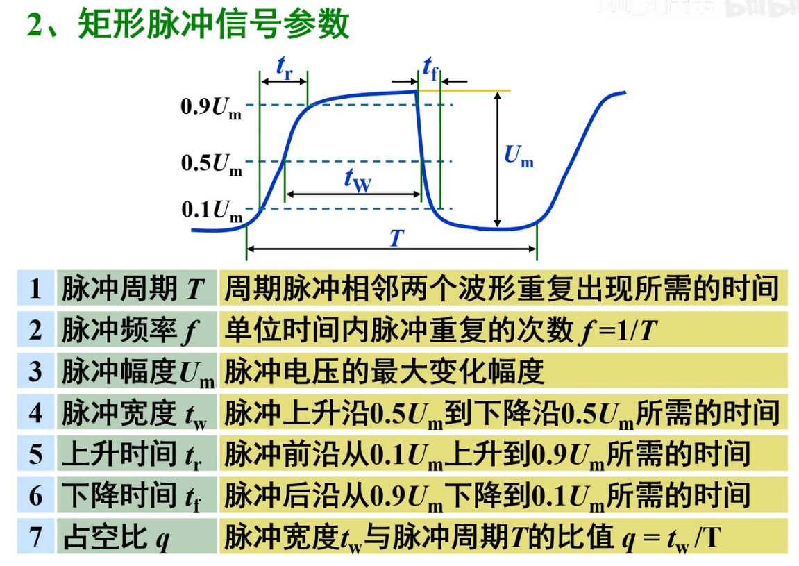

* 脉冲信号产生与整形的方法

* 获取脉冲信号的方法
  * 利用多谐振荡器直接产生
  * 利用整形电路
    * 施密特触发器
    * 单稳态触发器
* 脉冲信号的产生与整形电路的实现
  * 门电路
  * 集成电路
  * 555定时器

## 2. 555定时器

* 电路组成

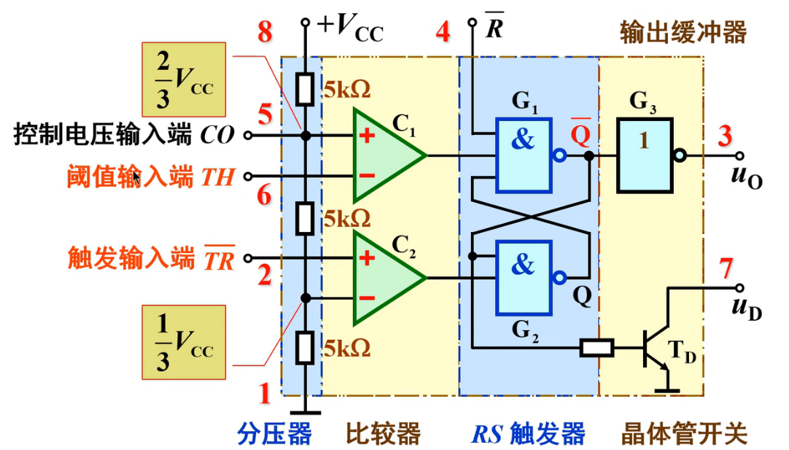

* ==基本功能(其实也就是SR触发器)==

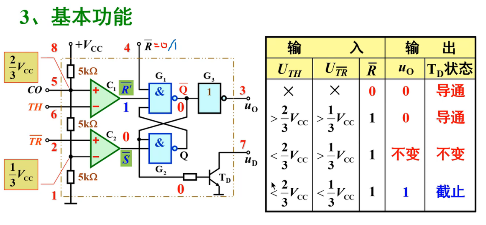

* 芯片管脚图

| 编号 |      引脚名称       |                            作用                             |
| :--: | :-----------------: | :---------------------------------------------------------: |
|  1   |         GND         |                            接地                             |
|  2   | $ \ U_ \frac{}{TR}$ | 触发电压输入端(与1/3Vcc比较) ==占用比较器的$ \ +$ 端== |
|  3   |         Uo          |                           输出端                            |
|  4   |    $ \frac{}{R}$    |                         异步清零端                          |
|  5   |         CO          |   改变比较器的基准电压 ==不使用的时候接0.01uF接GND==   |
|  6   |    $ \ U_ {TH}$     | 阈值电压输入端(与2/3Vcc比较) ==占用比较器的$ \ -$ 端== |
|  7   |         DIS         |                           放电端                            |
|  8   |         Vcc         |                            电源                             |

## 3. 施密特触发器

* **<u>==Ui < Ut+ , 输出1 , Ui > Ut+直至小于Ut-输出0==</u>**
  * 总之就是
    * ==<u>**在Ut+之后Ut-之前为0 , 在Ut-之后Ut+之前为1**</u>==

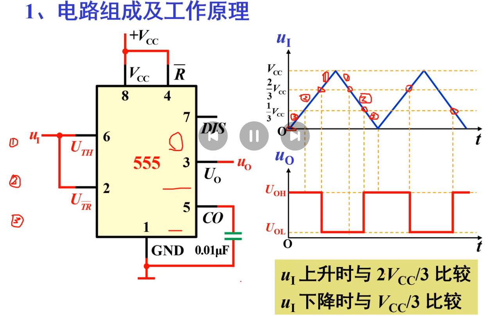

***

* 滞回特性

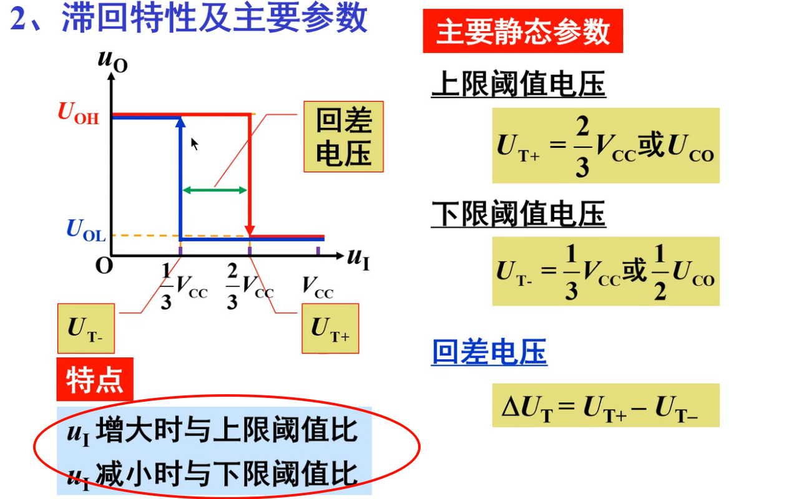

***

* 逻辑符号

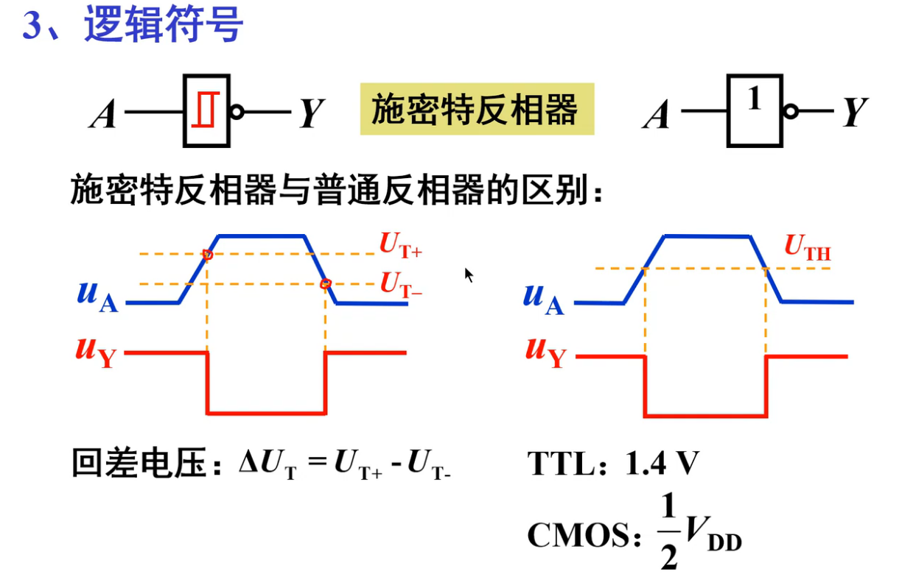

***

* 集成施密特触发器

* ① 74LS132 (施密特与非门)

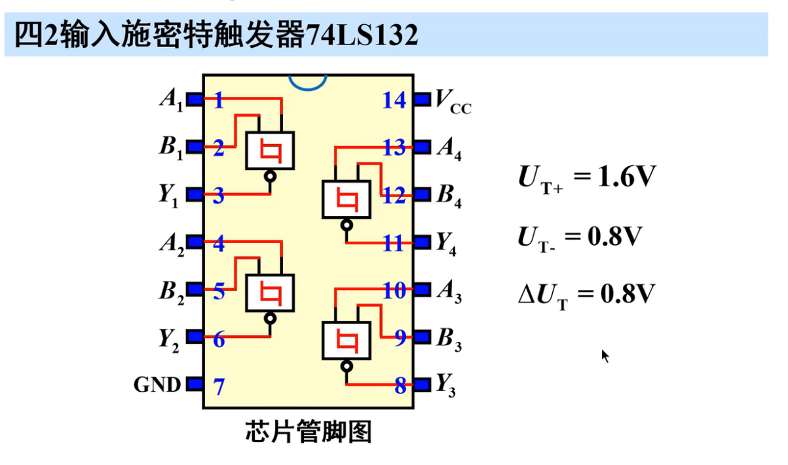

* ② CC40106(与非)

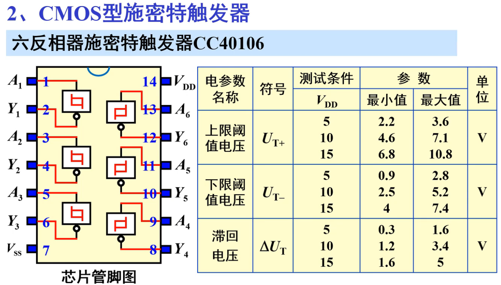

***

* 施密特触发器的应用
* 接口与整形

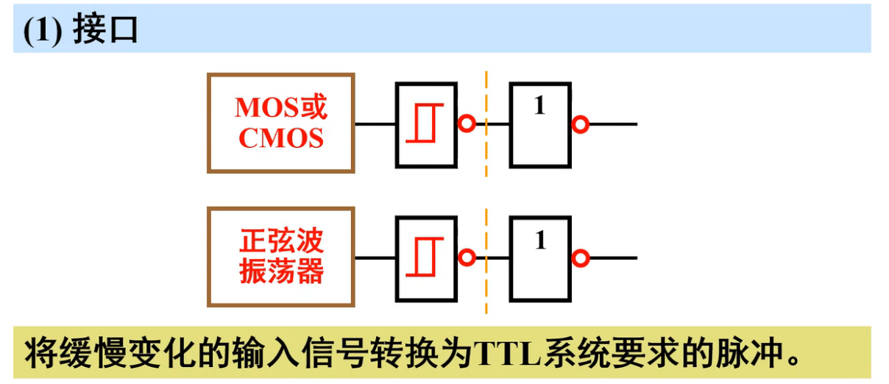

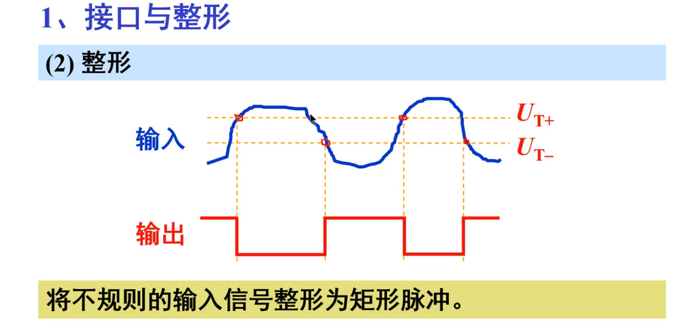

* 波形变换

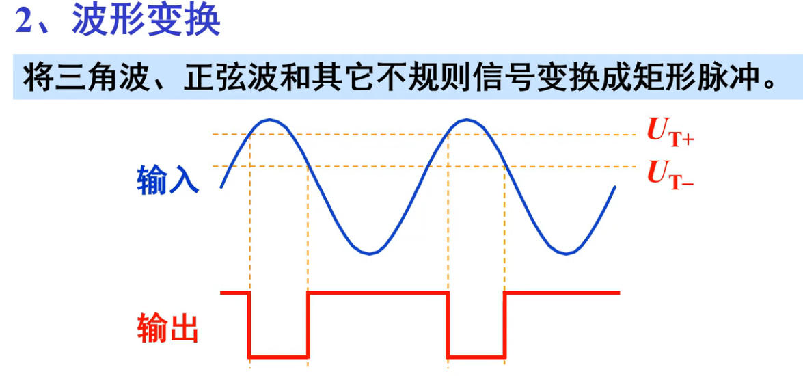

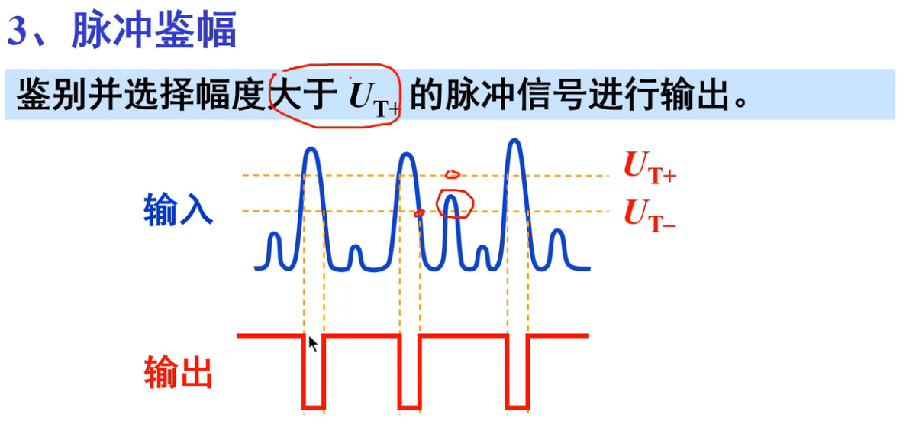

