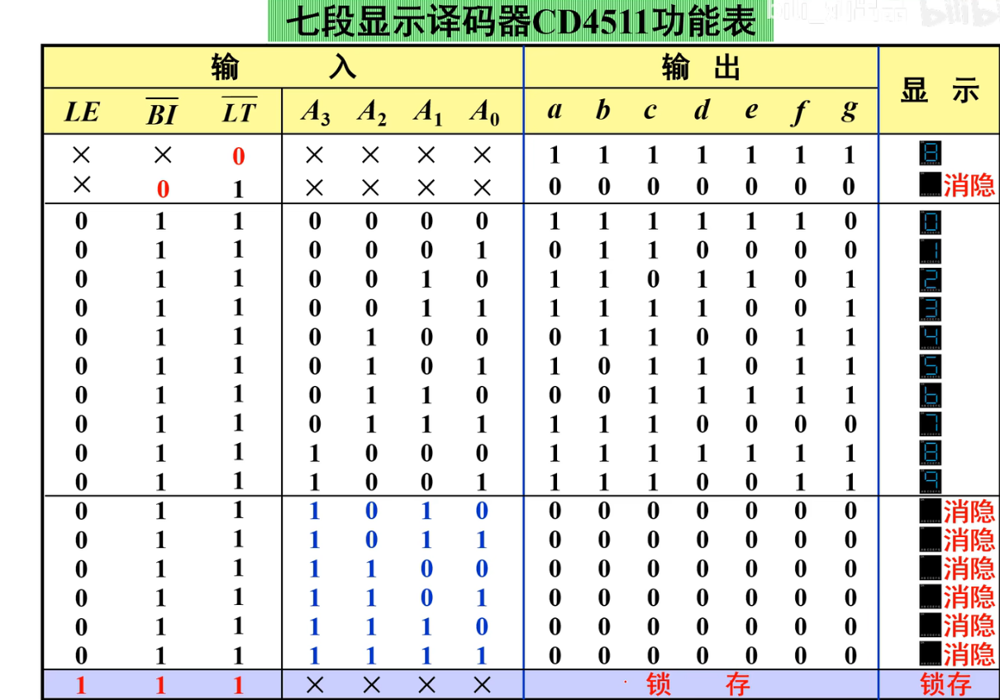

[toc]

# 芯片库

* 待学习仿真芯片

- [x] CD4511数码管显示译码器
- [x] 74HC161
- [ ] 74HC192

## 1. CD4511 数码管显示芯片

* 说明书 [DATASHEET SEARCH SITE | WWW.ALLDATASHEET.COM](https://www.semiee.com/file2/e0a0d4e89dd59842f3b225360f59ca35/backup/FAIRCHILD-CD4511BC.pdf)
* 管脚图与逻辑图

* 芯片引脚功能表
  * ~LT -> light 全亮(优先级最高)
  * ~BI -> blind 全灭(次高)
  * LE   -> Lock 锁存(次次高)

## 2. 74HC161 四位二进制自增计数器

* 说明书 [华冠74HC161](https://www.semiee.com/file2/2ffa36ddcdbf7a65de3b514b63fd8001/HGSEMI/HGSEMI-74HC161(英文) 202312.pdf)
* 管脚图与逻辑图

* 芯片引脚功能表
  * ~CR / ~MR : 异步置0
  * ~LD / ~PL   :同步置数
  * CPT和CTT只要有一个不为1就保持(锁存说是)

